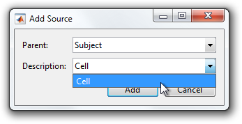

# Add Allowable Parents to an Entity Description

You can enforce hierarchical rules for your experiment entities by defining allowable parent types in your source and epoch group descriptions. For instance, if you have "Subject", "Preparation", and "Cell" source descriptions you may not want to allow nesting a "Subject" within a "Cell" or a "Preparation".

This tutorial shows how to add allowable parents to an `EntityDescription`.

- [Step 1: Create two source descriptions](#step-1-create-two-source-descriptions)
- [Step 2: Add allowable parents](#step-2-add-allowable-parents)

### Step 1: Create two source descriptions
[Create two source descriptions](Write-an-Entity-Description) called "Subject" and "Cell" so you have something to work with.

```matlab
classdef Subject < symphonyui.core.persistent.descriptions.SourceDescription

    methods

        function obj = Subject()
            obj.addProperty('id', '');
        end

    end

end
```

```matlab
classdef Cell < symphonyui.core.persistent.descriptions.SourceDescription

    methods

        function obj = Cell()
            obj.addProperty('type', '');
        end

    end

end
```

### Step 2: Add allowable parents
Add an allowable parent type of empty (i.e. allow no parent) to the "Subject" description by adding a line calling the `addAllowableParentType()` method.

```matlab
obj.addAllowableParentType([]);
```

Add an allowable parent type of "Subject" to the "Cell" description by adding a line calling the `addAllowableParentType()` method.

```matlab
obj.addAllowableParentType('edu.washington.riekelab.sources.Subject');
```

<table cellspacing="0" class="note" summary="Note" cellpadding="5" border="1"><tbody><tr width="90%"><td>
<b>Note:</b> You will need to replace "edu.washington.riekelab.sources." with your own package prefix.
</td></tr></tbody></table>

The two descriptions now define one allowable parent type each.

```matlab
classdef Subject < symphonyui.core.persistent.descriptions.SourceDescription

    methods

        function obj = Subject()
            obj.addProperty('id', '');
            obj.addAllowableParentType([]);
        end

    end

end
```

```matlab
classdef Cell < symphonyui.core.persistent.descriptions.SourceDescription

    methods

        function obj = Cell()
            obj.addProperty('type', '');
            obj.addAllowableParentType('edu.washington.riekelab.sources.Subject');
        end

    end

end
```

If you now attempt to add a source to an experiment, Symphony will only allow adding a "Subject" source at the top level and a "Cell" source below it.



