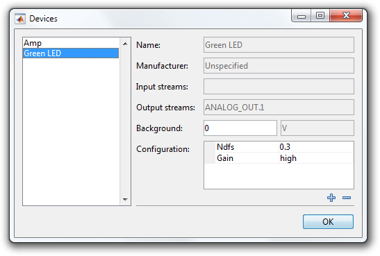

You can attach arbitrary key/value pairs, called configuration settings, to a device. Configuration settings can be used to document the state of a device during an experiment, such as its gain, mode, NDFs, etc. Configuration settings may be added on-the-fly in the **Devices** window after initializing a rig or explicitly defined in a `RigDescription`.

This tutorial shows how to add configuration settings to a device within a `RigDescription`.

- [Step 1: Open or create a rig description](#step-1-open-or-create-a-rig-description)
- [Step 2: Add configuration settings](#step-2-add-configuration-settings)

### Step 1: Open or create a rig description
Open or recreate the ["Demo" description](Write-a-Rig-Description) so you have something to work with.

```matlab
classdef Demo < symphonyui.core.descriptions.RigDescription

    methods

        function obj = Demo()
            import symphonyui.builtin.daqs.*;
            import symphonyui.builtin.devices.*;

            daq = HekaSimulationDaqController();
            obj.daqController = daq;

            % Add a MultiClamp device with name = Amp, channel = 1
            amp = MultiClampDevice('Amp', 1).bindStream(daq.getStream('ANALOG_OUT.0')).bindStream(daq.getStream('ANALOG_IN.0'));
            obj.addDevice(amp);

            % Add a LED device with name = Green LED, units = volts
            green = UnitConvertingDevice('Green LED', 'V').bindStream(daq.getStream('ANALOG_OUT.1'));
            obj.addDevice(green);
        end

    end

end
```

### Step 2: Add configuration settings
Add a configuration setting named "ndfs" with an initial value of "0.3" to the "Green LED" device by adding a line calling the `addConfigurationSetting()` method.

```matlab
green.addConfigurationSetting('ndfs', '0.3');
```

Add a configuration setting named "gain" with an initial value of "high" to the "Green LED" device by adding another line calling the `addConfigurationSetting()` method.

```matlab
green.addConfigurationSetting('gain', 'high');
```

The "Green LED" device now has two configuration settings.

```matlab
classdef Demo < symphonyui.core.descriptions.RigDescription

    methods

        function obj = Demo()
            import symphonyui.builtin.daqs.*;
            import symphonyui.builtin.devices.*;

            daq = HekaSimulationDaqController();
            obj.daqController = daq;

            % Add a MultiClamp device with name = Amp, channel = 1
            amp = MultiClampDevice('Amp', 1).bindStream(daq.getStream('ANALOG_OUT.0')).bindStream(daq.getStream('ANALOG_IN.0'));
            obj.addDevice(amp);

            % Add a LED device with name = Green LED, units = volts
            green = UnitConvertingDevice('Green LED', 'V').bindStream(daq.getStream('ANALOG_OUT.1'));
            green.addConfigurationSetting('ndfs', '0.3');
            green.addConfigurationSetting('gain', 'high');
            obj.addDevice(green);
        end

    end

end
```

Initialize the "Demo" description in Symphony and select **Configure > Devices** to view and edit the configuration settings.


