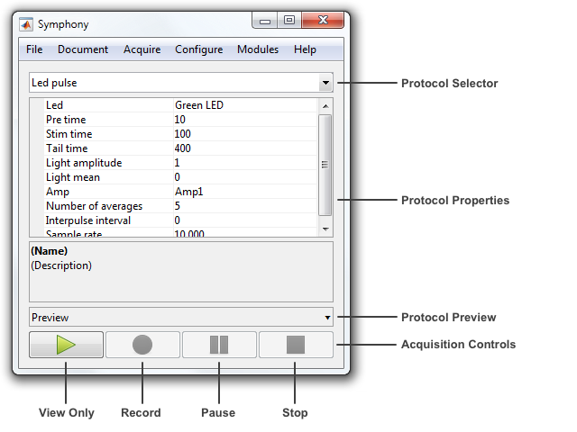

To launch Symphony click on its icon in the MATLAB Apps tab.

When Symphony starts you are prompted to initialize a rig.

Rigs are initialized by selecting a `RigDescription` and pressing **Initialize**. A `RigDescription` describes the devices in a rig. Symphony comes with a few example descriptions. Everyone can initialize with the "Empty" description. The other example descriptions require specific hardware, as indicated by their name.

After initializing a rig, the main Symphony window appears.

The main window includes:
- **Protocol Selector** - Select the current protocol.
- **Protocol Properties** - Edit the current protocol property values.
- **Protocol Preview** - Preview the current protocol stimuli.
- **Acquisition Controls** - Run, record, pause, and stop the current protocol.

Symphony is centered around protocol-driven acquisition. A `Protocol` is an acquisition routines you write in MATLAB using the Symphony framework. Symphony comes with a few example protocols listed under the protocol selector drop-down menu.

To use Symphony, you select a protocol in the protocol selector drop-down, edit its property values, and then press the **View Only** or **Record** button. The protocol's logic dictates the stimuli to present, responses to record, and online analysis to perform.

For example, select the "Pulse" protocol and change its "Pre time" and "Tail time" properties to 100.

If you now press the **View Only** button at the bottom of the window, the "Pulse" protocol will run and show the individual and mean response of presenting 5 rectangular pulse stimuli through the amplifier.

<table cellspacing="0" class="note" summary="Note" cellpadding="5" border="1"><tbody><tr width="90%"><td>
<b>Note:</b> You will receive an error if you run the protocol with an "Empty" rig because there is no available amplifier to output the pulse. Try using the "Simulated daq with multi clamp" rig instead. You will need the <a href="http://mdc.custhelp.com/app/answers/detail/a_id/18877">MultiClamp Commander</a> software running to initialize the rig but it can run in demo mode if you do not have an attached MultiClamp.
</td></tr></tbody></table>
