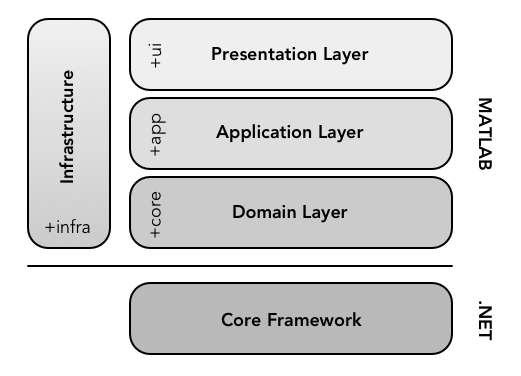

Symphony uses a layered architecture that helps to separate concerns and provides for a more cohesive design. There are three vertical layers that sit on top of the core framework: presentation, application, and domain. Each layer groups a set of cooperating components that specialize on a particular aspect of the program. Components within layers only have dependencies on other components within the same layer or layers below them.

## Layers

### Presentation
The presentation layer contains components that display the user interface and manage user interaction. This layer makes extensive use of the [model-view-presenter pattern](https://en.wikipedia.org/wiki/Model%E2%80%93view%E2%80%93presenter) (with [passive views](http://martinfowler.com/eaaDev/PassiveScreen.html)) to improve separation of concerns in presentation logic.

### Application
The application layer contains components that implement workflow (use case) logic. This layer exposes a series of services that act as an API for the system. The presentation layer makes use of these services to fulfill user requests. Services are generally lightweight and simply coordinate domain objects to do actual work.

### Domain
The domain layer contains components that implement business logic. In Symphony, many domain layer components are simply thin wrappers over core framework components.

### Infrastructure
The infrastructure layer contains implementations that support other layers (factories, repositories, etc).
