You conduct an experiment with Symphony by running a series of protocols and recording the results to file. Each file you create encompasses an entire experiment from start to finish, meaning that at the end of a session with Symphony you are generally left with a single file containing all of your data.

This tutorial shows how to create a file, add sources and epoch groups, and record epochs.

- [Step 1: Create a file](#step-1-create-a-file)
- [Step 2: Add a source hierarchy](#step-2-add-a-source-hierarchy)
- [Step 3: Begin an epoch group](#step-3-begin-an-epoch-group)
- [Step 4: Record epochs](#step-4-record-epochs)

### Step 1: Create a file
Create a new file by selecting **File > New...** on the Symphony main window.

You will be prompted to input a name and location for the file as well as select an `ExperimentDescription`. An `ExperimentDescription` describes metadata you want to attach to the experiment entity of the file. Select the "Electrophysiology" description and press **OK**.

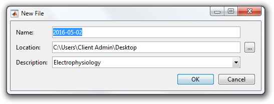

The **Data Manager** window will appear showing the contents of your file.

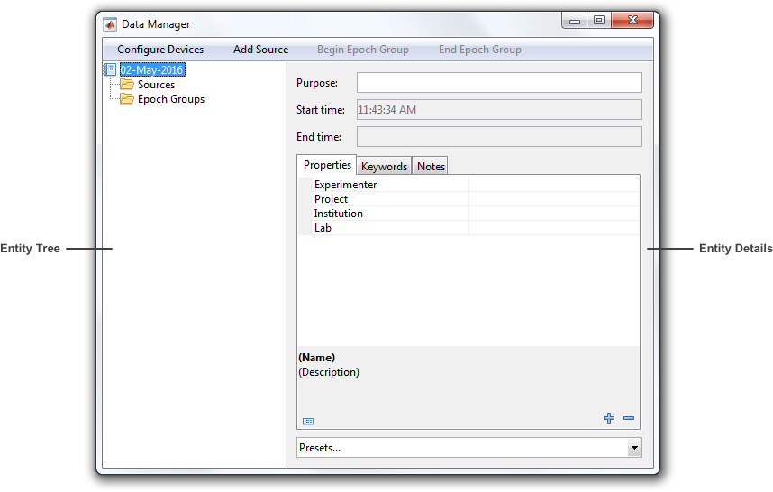

The data manager window is split into two panes:
- **Entity Tree** - Select entities in the file.
- **Entity Details** - Edit the currently selected entities.

At the root of the **Entity Tree** is the `Experiment` entity. Every file contains one, and only one, `Experiment`. You can enter the experiment details now in the **Entity Details** pane or come back to it at any time.

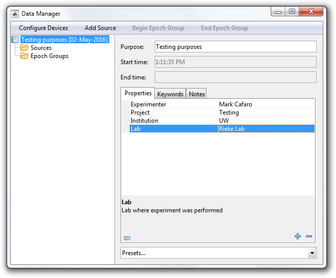

### Step 2: Add a source hierarchy
Before recording data you must add at least one `Source` to your experiment. A `Source` represents the subject of an experiment.

Add a source by selecting the **Add Source** button at the top of the **Data Manager** window. You will be prompted to select a parent and a `SourceDescription`. A `SourceDescription` describes metadata you want to attach to the source entity. Select the "Subject" description and press **Add**.

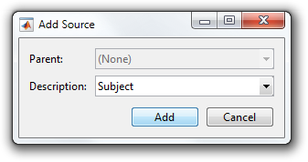

The experiment now contains a source called "Subject". You can enter the source details now or come back to it at any time.

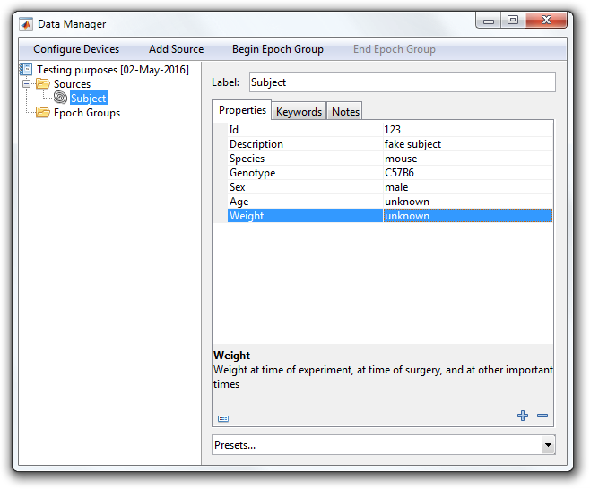

Sources may be nested to describe tissues, cells, regions, etc. contained within another source. Add a nested source by selecting the **Add Source** button again. Make sure "Subject" is selected as the parent and press **Add**.

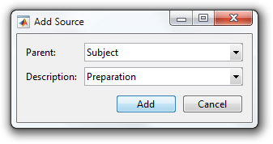

The "Subject" source now contains a nested source called "Preparation".

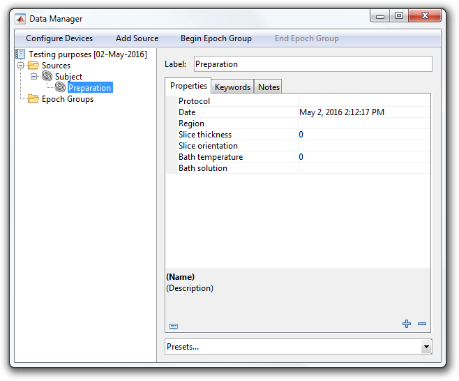

### Step 3: Begin an epoch group
Now that you have at least one source in your experiment, you can begin an `EpochGroup`. An `EpochGroup` represents a logical grouping of epochs within an experiment. Epochs are the fundamental unit of data in Symphony.

Begin an epoch group by selecting the **Begin Epoch Group** button at the top of the **Data Manager** window. You will be prompted to select a parent, a source, and an `EpochGroupDescription`. An `EpochGroupDescription` describes metadata you want to attach to the epoch group entity. Select the "Control" description and "Preparation" source and press **Begin**.

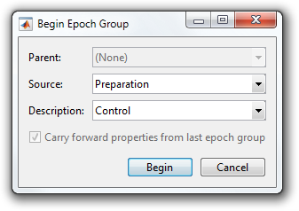

The experiment now contains an open epoch group called "Control". This is the current epoch group in the experiment, as indicated by the red dot in the lower right-hand corner of its icon. Epochs are always recorded to the current epoch group.

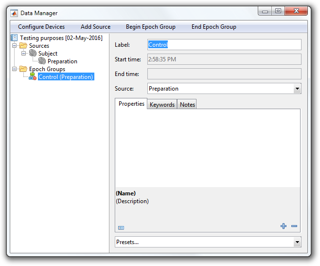

### Step 4: Record epochs
Now that you have a current epoch group, you can begin recording epochs. An `Epoch` represents a period of time in the experimental time line. It is a generalization of the common notion of a "trial".

If you look back at the main Symphony window you will notice that the **Record** button is now enabled.

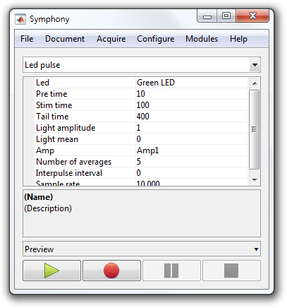

Select the "Led pulse" protocol in the main Symphony window and press **Record**. When the protocol completes, you will notice that a new epoch block entity called "Led pulse" exists under your current epoch group, and a series of epoch entities exist under that block.

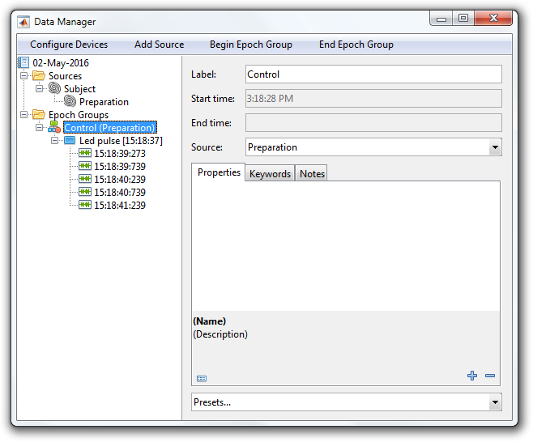

You can select any of these entities to view their details.

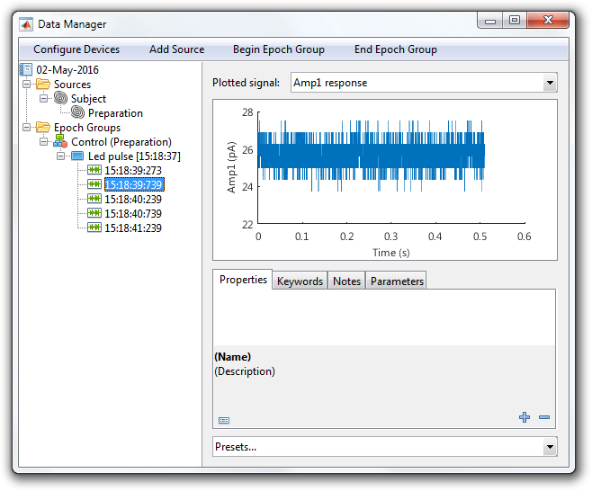

Select the "Pulse" protocol in the main Symphony window and press **Record** again. When the protocols completes, another block called "Pulse" will appear under your current epoch group.

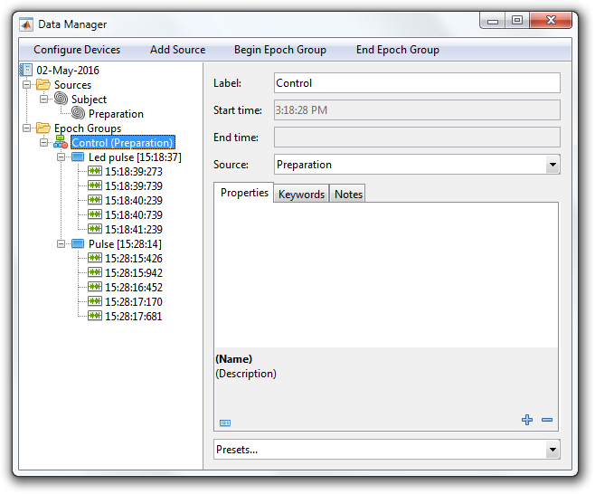

As you continue with your experiment, the "Sources" and "Epoch Groups" list will grow. You may, for instance, prepare another preparation or introduce another subject, in which case you will want to add more source entities. You may also end and begin new epoch groups to delineate changes in experimental conditions such as control, drug, and wash.

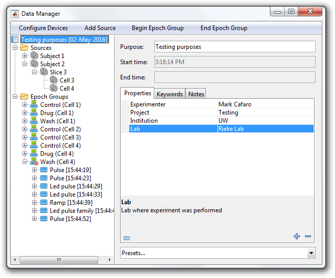

When you are finished with the experiment, close the **Data Manager** window and confirm you want to close the file.

A file containing your data will now exist at the location you specified in Step 1.

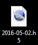
