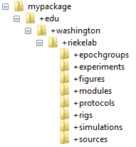

# Create a Package

Symphony comes with a number of example protocols, descriptions, modules, etc. but you will likely want to write your own to meet specific needs. While not required, it is highly recommended that you create a MATLAB package to store all of your custom files. From [Mathwork's documentation](http://www.mathworks.com/help/matlab/matlab_oop/scoping-classes-with-packages.html):

> Packages are special folders that can contain class folders, function, and class definition files, and other packages. [...] Using a package provides a means to organize classes and functions. Packages also enable you to reuse the names of classes and functions in different packages.

This tutorial shows how to create a package and add it to the Symphony path.

- [Step 1: Create a package](#step-1-create-a-package)
- [Step 2: Add your package to the Symphony path](#step-2-add-your-package-to-the-symphony-path)

### Step 1: Create a package
Packages are simply folders that begin with the "+" character. For example,

```
+mypack                     % a package
+mypack/pkfcn.m             % a function in the mypack package
+mypack/+mysubpack          % a sub-package in the mypack package
+mypack/+mysubpack/Hello.m  % a class in the mypack.mysubpack package
```

Symphony does not enforce a particular package structure or naming convention but [experience](https://docs.oracle.com/javase/tutorial/java/package/namingpkgs.html) dictates some recommendations.

1. Use all lowercase characters in your package folder names.
1. Use your reversed Internet domain name as a package prefix - for example, `edu.washington.riekelab` for a package created in the Rieke Lab at the University of Washington.

With these recommendations in mind, follow the example package structure below and create your own package directory. Replace the "edu", "washington", "riekelab" directories with ones that match your own domain name.

```
mypackage/                      % Directory containing your package
|-- +edu                        % Root directory of your package
|   |-- +washington
|   |   |-- +riekelab
|   |   |   |-- +epochgroups    % Contains your custom EpochGroupDescriptions
|   |   |   |-- +experiments    % Contains your custom ExperimentDescriptions
|   |   |   |-- +figures        % Contains your custom FigureHandlers
|   |   |   |-- +modules        % Contains your custom Modules
|   |   |   |-- +protocols      % Contains your custom Protocols
|   |   |   |-- +rigs           % Contains your custom RigDescriptions
|   |   |   |-- +sources        % Contains your custom SourceDescriptions
```

You should now have a package with no content.



<table cellspacing="0" class="note" summary="Note" cellpadding="5" border="1"><tbody><tr width="90%"><td>
<b>Note:</b> If you share a domain name with a number of users, for instance in a lab settings where multiple lab members are using Symphony, you may want to consider adding an additional level in your directory structure to distinguish between users. For example, a user named "Bob" may store all of his files in a package named edu.washington.riekelab.bob.*, while a user named "Jill" may store all of her files in a package named edu.washington.riekelab.jill.*.
</td></tr></tbody></table>

### Step 2: Add your package to the Symphony path
Symphony has a search path where it looks for custom packages when it starts.

To add your package to the search path, start Symphony and select **Configure > Options** on the main window.

When the **Options** window opens, select **Search Path** from the left-hand list.


<table cellspacing="0" class="note" summary="Note" cellpadding="5" border="1"><tbody><tr width="90%"><td>
<b>Note:</b> The search path currently contains the Symphony examples directory. Feel free to remove it but you may want to wait until you start building out your own content.
</td></tr></tbody></table>

Select **Add** and navigate to the directory containing your package.


Choose the directory containing your package and select **Select Folder**.

<table cellspacing="0" class="note" summary="Note" cellpadding="5" border="1"><tbody><tr width="90%"><td>
<b>Note:</b> You must choose the directory containing your package (the directory <i>containing</i> the directory starting with the "+" character). You cannot directly add directories starting with a "+" character to the Symphony path.
</td></tr></tbody></table>

You will now see the directory listing in your Symphony path.


Click **Save**. When Symphony starts it will now search your package for content.
