# File Format

Symphony persists data in the [HDF5 file format](https://www.hdfgroup.org/HDF5/). The figure below shows the basic structure of a Symphony data file. Each entity is represented as an HDF5 group. Each file comprises a single experiment entity, which is the only top level group.

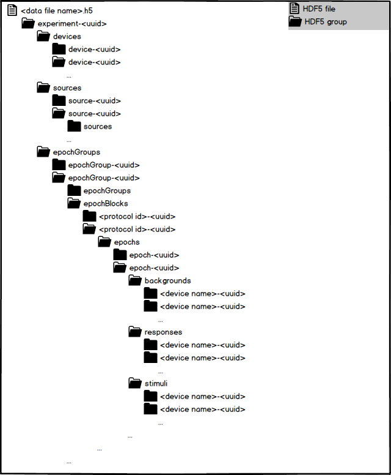

## Details

### File
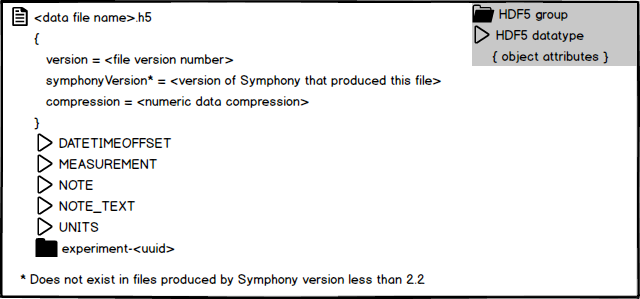

### Experiment
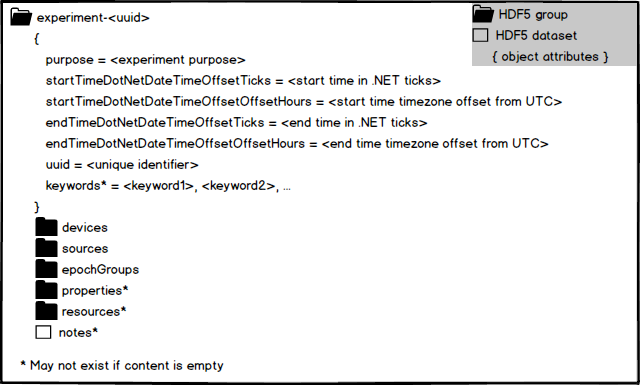

### Device
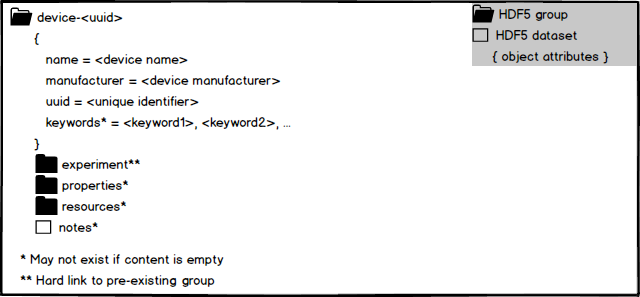

### Source
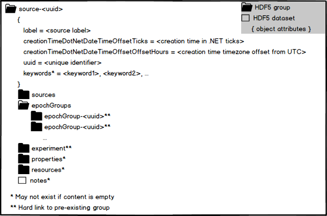

### Epoch Group
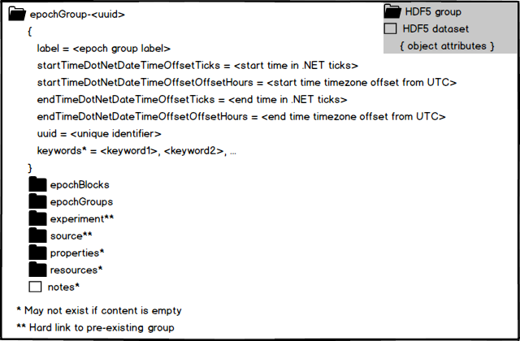

### Epoch Block
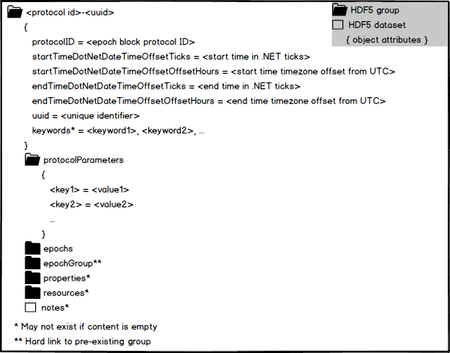

### Epoch
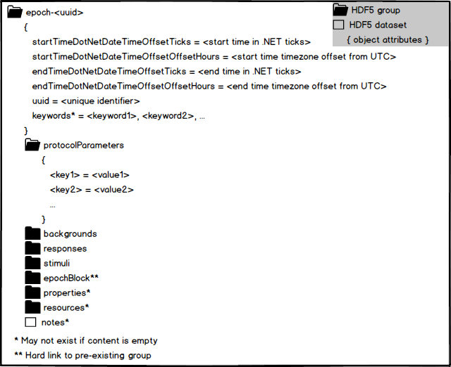

### Background
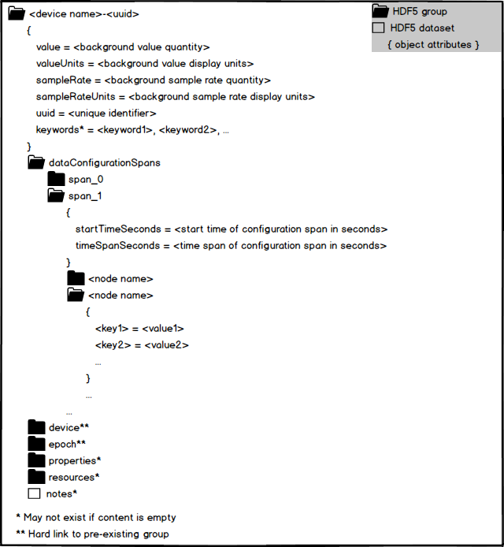

### Response
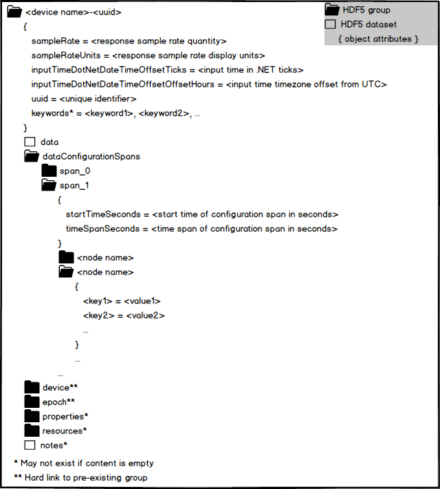

### Stimulus
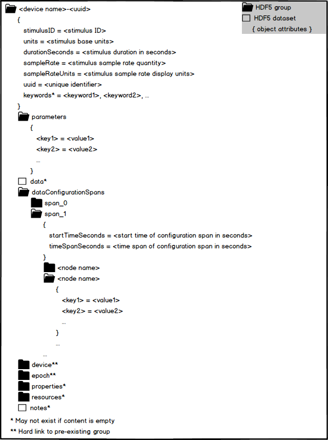

### Resource
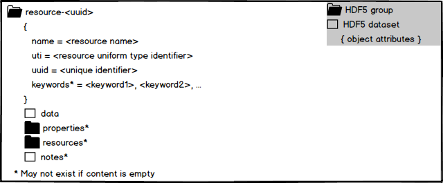
