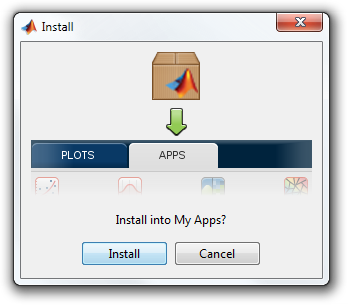

# Installation

### Step 1: Download the installer
Download the app installer (.mlappinstall) from the [Symphony releases page](https://github.com/Symphony-DAS/symphony-matlab2/releases).

### Step 2: Install the app into MATLAB
Double-click the downloaded app installer. MATLAB will open and you will be prompted to install the app.

