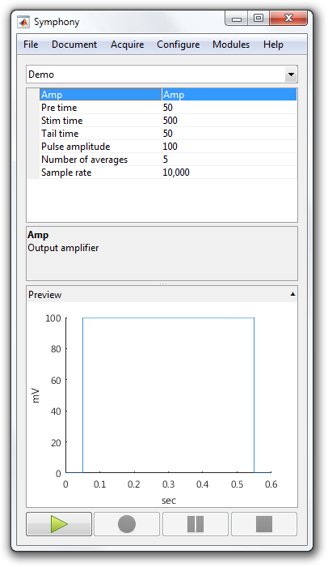

# Set the Preview for a Protocol

A `Protocol` may choose to show a preview of its stimuli in the **Protocol Preview** pane of the main Symphony window. Previews are useful for users that are unfamiliar with the protocol and how its properties affect its output.

This tutorial shows how to set the preview for a `Protocol`.

- [Step 1: Open or create a protocol](#step-1-open-or-create-a-protocol)
- [Step 2: Override getPreview](#step-2-override-getpreview)
- [Step 3: Refactor stimulus generation](#step-3-refactor-stimulus-generation)

### Step 1: Open or create a protocol
Open or recreate the ["Demo" protocol](Write-a-Protocol.md) so you have something to work with.

```matlab
classdef Demo < symphonyui.core.Protocol

    properties
        amp = 'Amp'                     % Output amplifier
        preTime = 50                    % Pulse leading duration (ms)
        stimTime = 500                  % Pulse duration (ms)
        tailTime = 50                   % Pulse trailing duration (ms)
        pulseAmplitude = 100            % Pulse amplitude (mV)
        numberOfAverages = 5            % Number of epochs
    end

    methods

        function prepareEpoch(obj, epoch)
            prepareEpoch@symphonyui.core.Protocol(obj, epoch);

            gen = symphonyui.builtin.stimuli.PulseGenerator();

            gen.preTime = obj.preTime;
            gen.stimTime = obj.stimTime;
            gen.tailTime = obj.tailTime;
            gen.amplitude = obj.pulseAmplitude;
            gen.mean = 0;
            gen.sampleRate = obj.sampleRate;
            gen.units = 'mV';

            stimulus = gen.generate();
            device = obj.rig.getDevice(obj.amp);

            epoch.addStimulus(device, stimulus);
            epoch.addResponse(device);
        end

        function tf = shouldContinuePreparingEpochs(obj)
            tf = obj.numEpochsPrepared < obj.numberOfAverages;
        end

        function tf = shouldContinueRun(obj)
            tf = obj.numEpochsCompleted < obj.numberOfAverages;
        end

    end

end
```

### Step 2: Override getPreview
A `Protocol` sets its preview by overriding the `getPreview()` method and returning a `ProtocolPreview` implementation. A `ProtocolPreview` manages a ui panel displayed by main Symphony window. It creates the panel controls (typically a plot) and updates the preview as protocol properties change value.

Symphony comes with one built-in `ProtocolPreview` implementation:

- `symphonyui.builtin.previews.StimuliPreview` - Displays a 2D plot of a set of stimuli.

Override the `getPreview()` method in the "Demo" protocol and return a `StimuliPreview` with a single pulse stimulus.

```matlab
classdef Demo < symphonyui.core.Protocol

    properties
        amp = 'Amp'                     % Output amplifier
        preTime = 50                    % Pulse leading duration (ms)
        stimTime = 500                  % Pulse duration (ms)
        tailTime = 50                   % Pulse trailing duration (ms)
        pulseAmplitude = 100            % Pulse amplitude (mV)
        numberOfAverages = 5            % Number of epochs
    end

    methods

        function p = getPreview(obj, panel)
            gen = symphonyui.builtin.stimuli.PulseGenerator();

            gen.preTime = obj.preTime;
            gen.stimTime = obj.stimTime;
            gen.tailTime = obj.tailTime;
            gen.amplitude = obj.pulseAmplitude;
            gen.mean = 0;
            gen.sampleRate = obj.sampleRate;
            gen.units = 'mV';

            stimulus = gen.generate();

            p = symphonyui.builtin.previews.StimuliPreview(panel, stimulus);
        end

        function prepareEpoch(obj, epoch)
            prepareEpoch@symphonyui.core.Protocol(obj, epoch);

            gen = symphonyui.builtin.stimuli.PulseGenerator();

            gen.preTime = obj.preTime;
            gen.stimTime = obj.stimTime;
            gen.tailTime = obj.tailTime;
            gen.amplitude = obj.pulseAmplitude;
            gen.mean = 0;
            gen.sampleRate = obj.sampleRate;
            gen.units = 'mV';

            stimulus = gen.generate();
            device = obj.rig.getDevice(obj.amp);

            epoch.addStimulus(device, stimulus);
            epoch.addResponse(device);
        end

        function tf = shouldContinuePreparingEpochs(obj)
            tf = obj.numEpochsPrepared < obj.numberOfAverages;
        end

        function tf = shouldContinueRun(obj)
            tf = obj.numEpochsCompleted < obj.numberOfAverages;
        end

    end

end
```

The "Demo" protocol now displays a pulse stimulus preview when the **Protocol Preview** panel is expanded.



### Step 3: Refactor stimulus generation
While the above code works, it's not particularly good. The preview does not update as the protocol properties change and the same stimulus generation code is repeated in `getPreview()` and `prepareEpoch()`. If your protocol has a preview it's often best to [refactor](https://en.wikipedia.org/wiki/Code_refactoring) the stimulus generation code into its own method.

Refactor the stimulus generation code into a `createAmpStimulus()` method and call that method in `getPreview()` and `prepareEpoch()` to avoid repeating code.

```matlab
classdef Demo < symphonyui.core.Protocol

    properties
        amp = 'Amp'                     % Output amplifier
        preTime = 50                    % Pulse leading duration (ms)
        stimTime = 500                  % Pulse duration (ms)
        tailTime = 50                   % Pulse trailing duration (ms)
        pulseAmplitude = 100            % Pulse amplitude (mV)
        numberOfAverages = 5            % Number of epochs
    end

    methods

        function p = getPreview(obj, panel)
            stimulus = obj.createAmpStimulus();
            p = symphonyui.builtin.previews.StimuliPreview(panel, stimulus);
        end

        function stim = createAmpStimulus(obj)
            gen = symphonyui.builtin.stimuli.PulseGenerator();

            gen.preTime = obj.preTime;
            gen.stimTime = obj.stimTime;
            gen.tailTime = obj.tailTime;
            gen.amplitude = obj.pulseAmplitude;
            gen.mean = 0;
            gen.sampleRate = obj.sampleRate;
            gen.units = 'mV';

            stim = gen.generate();
        end

        function prepareEpoch(obj, epoch)
            prepareEpoch@symphonyui.core.Protocol(obj, epoch);

            stimulus = obj.createAmpStimulus();
            device = obj.rig.getDevice(obj.amp);

            epoch.addStimulus(device, stimulus);
            epoch.addResponse(device);
        end

        function tf = shouldContinuePreparingEpochs(obj)
            tf = obj.numEpochsPrepared < obj.numberOfAverages;
        end

        function tf = shouldContinueRun(obj)
            tf = obj.numEpochsCompleted < obj.numberOfAverages;
        end

    end

end
```

To get the preview to update as the user changes protocol properties, pass in the `createAmpStimulus()` method as an anonymous funtion to `StimuliPreview` instead of passing in a generated stimulus.

```matlab
function p = getPreview(obj, panel)
    p = symphonyui.builtin.previews.StimuliPreview(panel, @obj.createAmpStimulus);
end
```

You now have a `Protocol` with a preview that updates when the user changes protocol property values.

```matlab
classdef Demo < symphonyui.core.Protocol

    properties
        amp = 'Amp'                     % Output amplifier
        preTime = 50                    % Pulse leading duration (ms)
        stimTime = 500                  % Pulse duration (ms)
        tailTime = 50                   % Pulse trailing duration (ms)
        pulseAmplitude = 100            % Pulse amplitude (mV)
        numberOfAverages = 5            % Number of epochs
    end

    methods

        function p = getPreview(obj, panel)
            p = symphonyui.builtin.previews.StimuliPreview(panel, @obj.createAmpStimulus);
        end

        function stim = createAmpStimulus(obj)
            gen = symphonyui.builtin.stimuli.PulseGenerator();

            gen.preTime = obj.preTime;
            gen.stimTime = obj.stimTime;
            gen.tailTime = obj.tailTime;
            gen.amplitude = obj.pulseAmplitude;
            gen.mean = 0;
            gen.sampleRate = obj.sampleRate;
            gen.units = 'mV';

            stim = gen.generate();
        end

        function prepareEpoch(obj, epoch)
            prepareEpoch@symphonyui.core.Protocol(obj, epoch);

            stimulus = obj.createAmpStimulus();
            device = obj.rig.getDevice(obj.amp);

            epoch.addStimulus(device, stimulus);
            epoch.addResponse(device);
        end

        function tf = shouldContinuePreparingEpochs(obj)
            tf = obj.numEpochsPrepared < obj.numberOfAverages;
        end

        function tf = shouldContinueRun(obj)
            tf = obj.numEpochsCompleted < obj.numberOfAverages;
        end

    end

end
```
