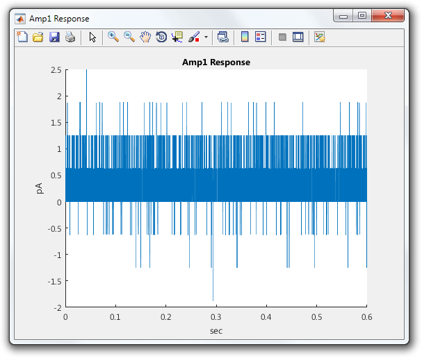
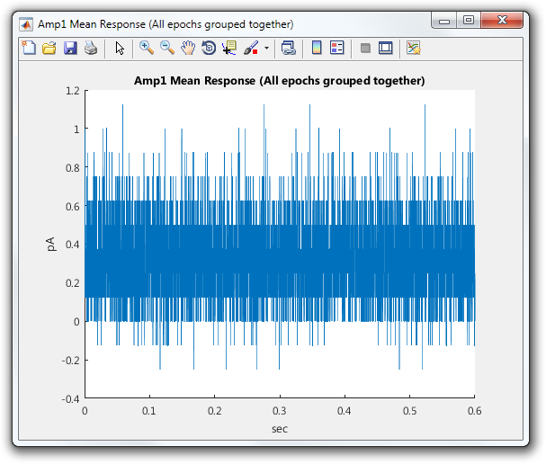

# Show Figure Handlers in a Protocol

A `FigureHandler` manages a figure displayed by a protocol. It creates the figure controls (typically a plot) and updates the figure as each epoch completes. A `FigureHandler` is generally used to graphically present data and perform online analysis.

This tutorial shows how to show `FigureHandlers` in a protocol.

- [Step 1: Open or create a protocol](#step-1-open-or-create-a-protocol)
- [Step 2: Override prepareRun](#step-2-override-preparerun)
- [Step 3: Show figure handlers](#step-3-show-figure-handlers)

### Step 1: Open or create a protocol
Open or recreate the ["Demo" protocol](Write-a-Protocol) so you have something to work with.

```matlab
classdef Demo < symphonyui.core.Protocol

    properties
        amp = 'Amp'                     % Output amplifier
        preTime = 50                    % Pulse leading duration (ms)
        stimTime = 500                  % Pulse duration (ms)
        tailTime = 50                   % Pulse trailing duration (ms)
        pulseAmplitude = 100            % Pulse amplitude (mV)
        numberOfAverages = 5            % Number of epochs
    end

    methods

        function prepareEpoch(obj, epoch)
            prepareEpoch@symphonyui.core.Protocol(obj, epoch);

            gen = symphonyui.builtin.stimuli.PulseGenerator();

            gen.preTime = obj.preTime;
            gen.stimTime = obj.stimTime;
            gen.tailTime = obj.tailTime;
            gen.amplitude = obj.pulseAmplitude;
            gen.mean = 0;
            gen.sampleRate = obj.sampleRate;
            gen.units = 'mV';

            stimulus = gen.generate();
            device = obj.rig.getDevice(obj.amp);

            epoch.addStimulus(device, stimulus);
            epoch.addResponse(device);
        end

        function tf = shouldContinuePreparingEpochs(obj)
            tf = obj.numEpochsPrepared < obj.numberOfAverages;
        end

        function tf = shouldContinueRun(obj)
            tf = obj.numEpochsCompleted < obj.numberOfAverages;
        end

    end

end
```

### Step 2: Override prepareRun
`FigureHandlers` are generally shown in the `prepareRun()` method which is executed when a protocol starts but before any epochs have run.

Override the `prepareRun()` method in the "Demo" protocol.

```matlab
classdef Demo < symphonyui.core.Protocol

    properties
        amp = 'Amp'                     % Output amplifier
        preTime = 50                    % Pulse leading duration (ms)
        stimTime = 500                  % Pulse duration (ms)
        tailTime = 50                   % Pulse trailing duration (ms)
        pulseAmplitude = 100            % Pulse amplitude (mV)
        numberOfAverages = 5            % Number of epochs
    end

    methods

        function prepareRun(obj)
            prepareRun@symphonyui.core.Protocol(obj);

        end

        function prepareEpoch(obj, epoch)
            prepareEpoch@symphonyui.core.Protocol(obj, epoch);

            gen = symphonyui.builtin.stimuli.PulseGenerator();

            gen.preTime = obj.preTime;
            gen.stimTime = obj.stimTime;
            gen.tailTime = obj.tailTime;
            gen.amplitude = obj.pulseAmplitude;
            gen.mean = 0;
            gen.sampleRate = obj.sampleRate;
            gen.units = 'mV';

            stimulus = gen.generate();
            device = obj.rig.getDevice(obj.amp);

            epoch.addStimulus(device, stimulus);
            epoch.addResponse(device);
        end

        function tf = shouldContinuePreparingEpochs(obj)
            tf = obj.numEpochsPrepared < obj.numberOfAverages;
        end

        function tf = shouldContinueRun(obj)
            tf = obj.numEpochsCompleted < obj.numberOfAverages;
        end

    end

end
```

<table cellspacing="0" class="note" summary="Note" cellpadding="5" border="1"><tbody><tr width="90%"><td>
<b>Note:</b> Make sure you call the superclass method when you override <code>prepareRun()</code>.
</td></tr></tbody></table>

### Step 3: Show figure handlers
Symphony comes with four built-in `FigureHandler` implementations:

- `symphonyui.builtin.figures.ResponseFigure` - Plots the response of a specified device in the most recent epoch.
- `symphonyui.builtin.figures.ResponseStatisticsFigure` - Plots statistics calculated from the response of a specified device for each epoch run.
- `symphonyui.builtin.figures.MeanResponseFigure` - Plots the mean response of a specified device for all epochs run.
- `symphonyui.builtin.figures.CustomFigure` - Delegates to a specified callback function to handle creating and updating the controls of the figure.

Show a `ResponseFigure` in the "Demo" protocol by adding a line calling the `showFigure()` method and passing it the "Amp" device.

```matlab
function prepareRun(obj)
    prepareRun@symphonyui.core.Protocol(obj);

    obj.showFigure('symphonyui.builtin.figures.ResponseFigure', obj.rig.getDevice(obj.amp));
end
```

Show a `MeanResponseFigure` in the "Demo" protocol by adding another line calling the `showFigure()` method and passing it the "Amp" device.

```matlab
function prepareRun(obj)
    prepareRun@symphonyui.core.Protocol(obj);

    obj.showFigure('symphonyui.builtin.figures.ResponseFigure', obj.rig.getDevice(obj.amp));
    obj.showFigure('symphonyui.builtin.figures.MeanResponseFigure', obj.rig.getDevice(obj.amp));
end
```

The "Demo" protocol now displays two figures when it is run. Each figure automatically updates when an epoch completes.




