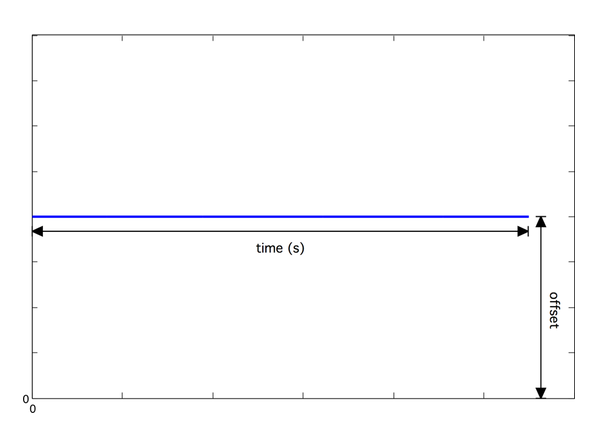
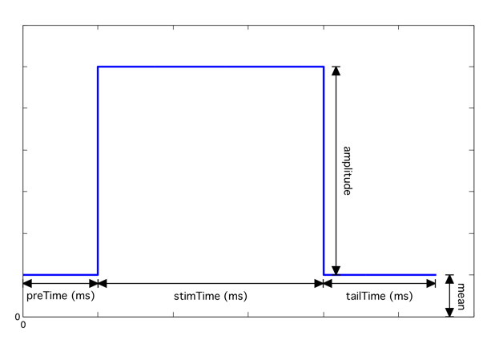
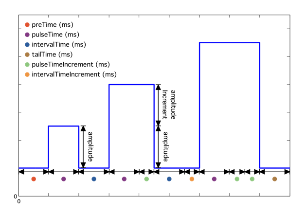
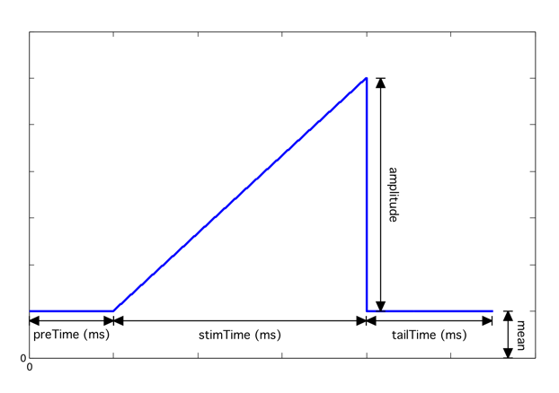
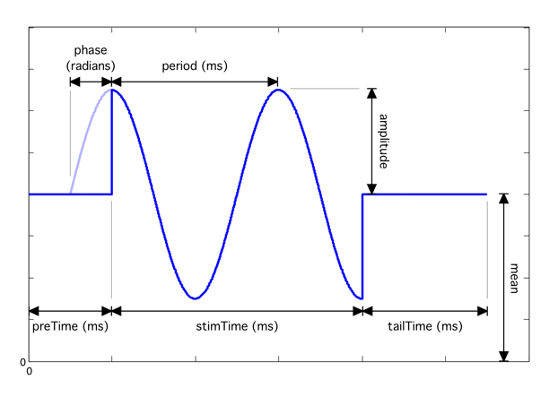
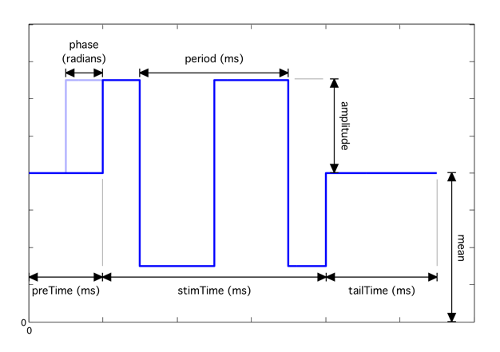
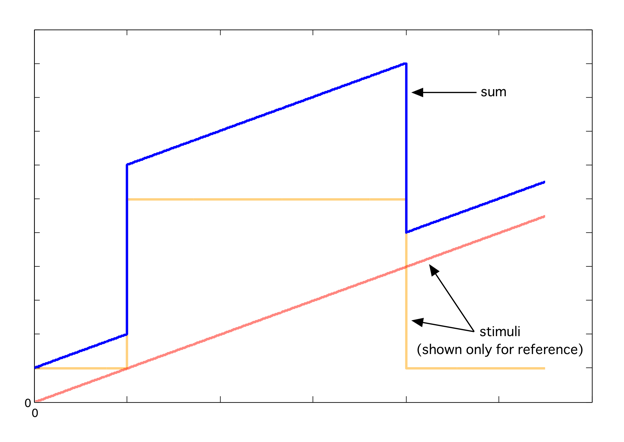
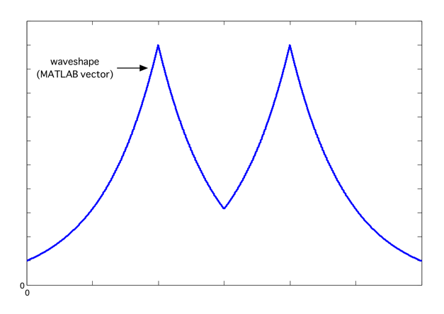

Symphony includes a number of built-in `StimulusGenerators`.

- [DirectCurrentGenerator](#directcurrentgenerator)
- [PulseGenerator](#pulsegenerator)
- [PulseTrainGenerator](#pulsetraingenerator)
- [RampGenerator](#rampgenerator)
- [RepeatingPulseGenerator](#repeatingpulsegenerator)
- [SineGenerator](#sinegenerator)
- [SquareGenerator](#squaregenerator)
- [SumGenerator](#sumgenerator)
- [WaveformGenerator](#waveformgenerator)

### DirectCurrentGenerator
*symphonyui.builtin.stimuli.DirectCurrentGenerator*  
Generates a constant, zero-frequency, direct current stimulus.
- time - Duration (s)
- offset - Mean value (units)
- sampleRate - Sample rate of generated stimulus (Hz)
- units - Units of generated stimulus

### PulseGenerator
*symphonyui.builtin.stimuli.PulseGenerator*  
Generates a single rectangular pulse stimulus.
- preTime - Leading duration (ms)
- stimTime - Pulse duration (ms)
- tailTime - Trailing duration (ms)
- amplitude - Pulse amplitude (units)
- mean - Mean amplitude (units)
- sampleRate - Sample rate of generated stimulus (Hz)
- units - Units of generated stimulus

### PulseTrainGenerator
*symphonyui.builtin.stimuli.PulseTrainGenerator*  
Generates a rectangular pulse train stimulus.
- preTime - Leading duration before the train (ms)
- pulseTime - Duration of each pulse in the train (ms)
- intervalTime - Inter-pulse interval duration (ms)
- tailTime - Trailing duration after the train (ms)
- amplitude - Pulse amplitude (units)
- mean - Mean amplitude (units)
- numPulses - Number of pulses in the train
- pulseTimeIncrement - Amount to increment the pulse duration with every pulse in the train (ms)
- intervalTimeIncrement - Amount to increment the inter-pulse interval duration with every pulse in the train (ms)
- amplitudeIncrement - Amount to increment the pulse amplitude with every pulse in the train (units)
- sampleRate - Sample rate of generated stimulus (Hz)
- units - Units of generated stimulus

### RampGenerator
*symphonyui.builtin.stimuli.RampGenerator*  
Generates a single linear ramp stimulus.
- preTime - Leading duration (ms)
- stimTime - Ramp duration (ms)
- tailTime - Trailing duration (ms)
- amplitude - Ramp peak amplitude (units)
- mean - Mean amplitude (units)
- sampleRate - Sample rate of generated stimulus (Hz)
- units - Units of generated stimulus

### RepeatingPulseGenerator
*symphonyui.builtin.stimuli.RepeatingPulseGenerator*  
Generates an indefinitely repeating rectangular pulse stimulus.
- preTime - Leading duration (ms)
- stimTime - Pulse duration (ms)
- tailTime - Trailing duration (ms)
- amplitude - Pulse amplitude (units)
- mean - Mean amplitude (units)
- sampleRate - Sample rate of generated stimulus (Hz)
- units - Units of generated stimulus

### SineGenerator
*symphonyui.builtin.stimuli.SineGenerator*  
Generates a sine wave stimulus.
- preTime - Leading duration (ms)
- stimTime - Sine wave duration (ms)
- tailTime - Trailing duration (ms)
- amplitude - Sine wave amplitude (units)
- period - Sine wave period (ms)
- phase - Sine wave phase offset (radians)
- mean - Mean amplitude (units)
- sampleRate - Sample rate of generated stimulus (Hz)
- units - Units of generated stimulus

### SquareGenerator
*symphonyui.builtin.stimuli.SquareGenerator*  
Generates a square wave stimulus.
- preTime - Leading duration (ms)
- stimTime - Square wave duration (ms)
- tailTime - Trailing duration (ms)
- amplitude - Square wave amplitude (units)
- period - Square wave period (ms)
- phase - Square wave phase offset (radians)
- mean - Mean amplitude (units)
- sampleRate - Sample rate of generated stimulus (Hz)
- units - Units of generated stimulus

### SumGenerator
*symphonyui.builtin.stimuli.SumGenerator*  
Generates a stimulus from the sum of a set of specified stimuli. All stimuli must have the same duration, units, and sample rate.
- stimuli - Cell array of stimuli to sum

### WaveformGenerator
*symphonyui.builtin.stimuli.WaveformGenerator*  
Generates an arbitrary waveform stimulus from a specified vector.
- waveshape - Wave as a vector (units)
- sampleRate - Sample rate of generated stimulus (Hz)
- units - Units of generated stimulus

