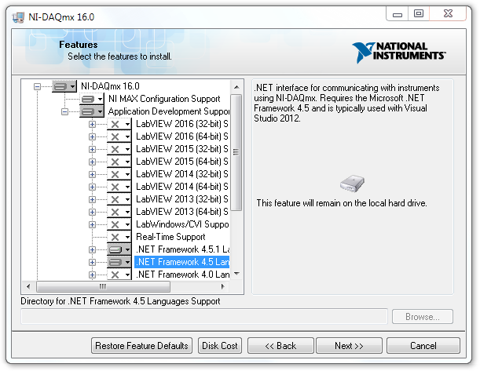

# System Requirements

### General
- [MATLAB R2016a+ (x64)](http://www.mathworks.com/products/matlab/)
- [Windows 7+ (x64)](http://windows.microsoft.com/windows-7)
- [.NET Framework 4.5](https://www.microsoft.com/en-us/download/details.aspx?id=30653&ocid=1484856)

### National Instruments Specific
- [NI-DAQmx Drivers](http://www.ni.com/nisearch/app/main/p/bot/no/ap/tech/lang/en/pg/1/sn/catnav:du,n8:3478.41.181.5495,ssnav:ndr/)  
Make sure you select "Custom" install during the NI-DAQmx setup process and choose to install ".NET Framework 4.5 Languages Support" in addition to the drivers.  

### HEKA (InstruTECH) Specific
- [HEKA Drivers](http://www.heka.com/downloads/downloads_main.html#down_acq)

### MultiClamp Specific
- [MultiClamp Commander](http://mdc.custhelp.com/app/answers/detail/a_id/18877)
