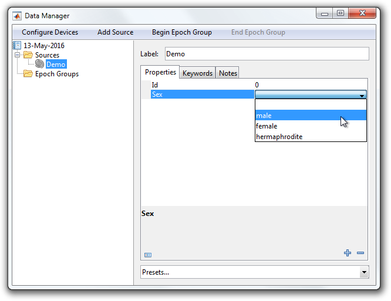

# Use Property Descriptors in a Description

This tutorial shows how to use `PropertyDescriptors` within a description.

- [Step 1: Open or create an entity description](#step-1-open-or-create-an-entity-description)
- [Step 2: Constrain property values](#step-2-constrain-property-values)

### Step 1: Open or create an entity description
Open or recreate the ["Demo" source description](Write-an-Entity-Description) so you have something to work with.

```matlab
classdef Demo < symphonyui.core.persistent.descriptions.SourceDescription

    methods

        function obj = Demo()
            obj.addProperty('id', '');
            obj.addProperty('sex', '');
        end

    end

end
```

### Step 2: Constrain property values
Edit the line where you add the "id" property to specify a `PropertyType` that constrains the value to a double.

```matlab
obj.addProperty('id', 0, ...
    'type', symphonyui.core.PropertyType('denserealdouble', 'scalar'));
```

<table cellspacing="0" class="note" summary="Note" cellpadding="5" border="1"><tbody><tr width="90%"><td>
<b>Note:</b> You must change the initial value to 0 because you are specifying a "denserealdouble" <code>PropertyType</code> and the initial value must now be a denserealdouble.
</td></tr></tbody></table>

Edit the line where you add the "sex" property to specify a `PropertyType` that constrains the value to a selection of possible values.

```matlab
obj.addProperty('sex', '', ...
    'type', symphonyui.core.PropertyType('char', 'row', {'', 'male', 'female', 'hermaphrodite'}));
```

Now if you add a source using the "Demo" description you will see that the property values are constrained by the types you specified.


