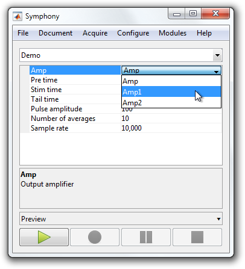
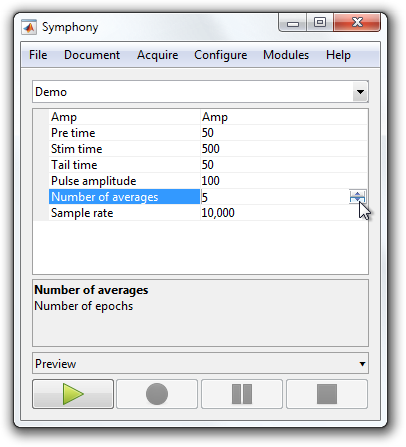

# Use Property Descriptors in a Protocol

Protocols automatically generate a `PropertyDescriptor` for all properties based on [property attributes](http://www.mathworks.com/help/matlab/matlab_oop/property-attributes.html) defined in the protocol's class. For example, a property with a `Constant` attribute generates a descriptor with "isReadOnly" true, while a property with a `Hidden` attribute generates a descriptor with "isHidden" true.

Property attributes may not be sufficient, however, to fully describe a property's type. In that case, you need to explicitly define the type of the `PropertyDescriptor`.

This tutorial shows how to explicitly define the type of a property's `PropertyDescriptor` within a protocol.

- [Step 1: Open or create a protocol](#step-1-open-or-create-a-protocol)
- [Step 2: Add type properties](#step-2-add-type-properties)

### Step 1: Open or create a protocol
Open or recreate the ["Demo" protocol](Write-a-Protocol.md) so you have something to work with.

```matlab
classdef Demo < symphonyui.core.Protocol

    properties
        amp = 'Amp'                     % Output amplifier
        preTime = 50                    % Pulse leading duration (ms)
        stimTime = 500                  % Pulse duration (ms)
        tailTime = 50                   % Pulse trailing duration (ms)
        pulseAmplitude = 100            % Pulse amplitude (mV)
        numberOfAverages = 5            % Number of epochs
    end

    methods

        function prepareEpoch(obj, epoch)
            prepareEpoch@symphonyui.core.Protocol(obj, epoch);

            gen = symphonyui.builtin.stimuli.PulseGenerator();

            gen.preTime = obj.preTime;
            gen.stimTime = obj.stimTime;
            gen.tailTime = obj.tailTime;
            gen.amplitude = obj.pulseAmplitude;
            gen.mean = 0;
            gen.sampleRate = obj.sampleRate;
            gen.units = 'mV';

            stimulus = gen.generate();
            device = obj.rig.getDevice(obj.amp);

            epoch.addStimulus(device, stimulus);
            epoch.addResponse(device);
        end

        function tf = shouldContinuePreparingEpochs(obj)
            tf = obj.numEpochsPrepared < obj.numberOfAverages;
        end

        function tf = shouldContinueRun(obj)
            tf = obj.numEpochsCompleted < obj.numberOfAverages;
        end

    end

end
```

### Step 2: Add type properties
To define the type of individual properties within a protocol you add hidden properties that follow the naming format "[property_name_here]Type" and have a value of class `symphonyui.core.PropertyType`.

Add a property type to the `numberOfAverages` property such that the property is constrained to a 16-bit unsigned integer with a value between 1 and 10.

```matlab
properties
    amp = 'Amp'                     % Output amplifier
    preTime = 50                    % Pulse leading duration (ms)
    stimTime = 500                  % Pulse duration (ms)
    tailTime = 50                   % Pulse trailing duration (ms)
    pulseAmplitude = 100            % Pulse amplitude (mV)
    numberOfAverages = uint16(5)    % Number of epochs
end

properties (Hidden)
    numberOfAveragesType = symphonyui.core.PropertyType('uint16', 'scalar', [1 10])
end
```

<table cellspacing="0" class="note" summary="Note" cellpadding="5" border="1"><tbody><tr width="90%"><td>
<b>Note:</b> You must also change the default value of <code>numberOfAverages</code> such that it fits the new type (i.e. uint16 with a value from 1 to 10).
</td></tr></tbody></table>

Add a property type to the `amp` property such that the property is constrained to a row of chars (i.e. a string) with a value of "Amp", "Amp1", or "Amp2".

```matlab
properties
    amp = 'Amp'                     % Output amplifier
    preTime = 50                    % Pulse leading duration (ms)
    stimTime = 500                  % Pulse duration (ms)
    tailTime = 50                   % Pulse trailing duration (ms)
    pulseAmplitude = 100            % Pulse amplitude (mV)
    numberOfAverages = uint16(5)    % Number of epochs
end

properties (Hidden)
    ampType = symphonyui.core.PropertyType('char', 'row', {'Amp', 'Amp1', 'Amp2'})
    numberOfAveragesType = symphonyui.core.PropertyType('uint16', 'scalar', [1 10])
end
```

Select the "Demo" protocol in Symphony and see how the use of these types has affected how the properties are edited.




