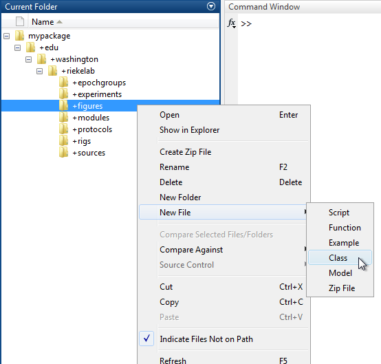
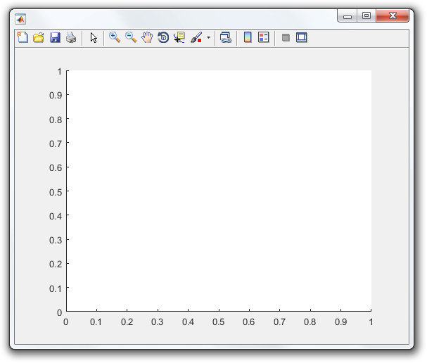
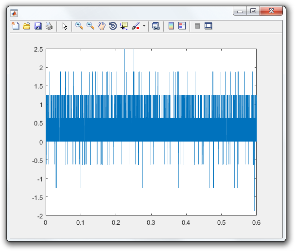

# Write a Figure Handler

A `FigureHandler` manages a figure displayed by a protocol. It creates the figure controls (typically a plot) and updates the figure as each epoch completes. A `FigureHandler` is generally used to graphically present data and perform online analysis.

This tutorial shows how to write a `FigureHandler`.

- [Step 1:Create a class](#step-1-create-a-class)
- [Step 2:Create a constructor](#step-2-create-a-constructor)
- [Step 3:Override handleEpoch](#step-3-override-handleepoch)

### Step 1: Create a class
A `FigureHandler` is simply a MATLAB class that [subclasses](http://www.mathworks.com/help/matlab/matlab_oop/creating-subclasses--syntax-and-techniques.html) from `symphonyui.core.FigureHandler`.

Create a new class in your personal Symphony [package](Create-a-Package) by navigating to the package in MATLAB's **Current Folder**, right-clicking on the "+figures" directory, and selecting **New File > Class**.



Name the class file "Demo.m" and open it in the MATLAB Editor.

```matlab
classdef Demo
    %DEMO Summary of this class goes here
    %   Detailed explanation goes here

    properties
    end

    methods
    end

end
```

Remove the comments and edit the classdef line to subclass from the `symphonyui.core.FigureHandler` class.

```matlab
classdef Demo < symphonyui.core.FigureHandler

    properties
    end

    methods
    end

end
```

You now have an empty `FigureHandler`.

### Step 2: Create a constructor
You add plots and user interface controls to a figure handler in the [constructor method](http://www.mathworks.com/help/matlab/matlab_oop/class-constructor-methods.html). You can also accept parameters passed in by a protocol in the constructor.

Add a constructor method to the "Demo" figure handler with a "device" parameter.

```matlab
classdef Demo < symphonyui.core.FigureHandler

    properties
    end

    methods

        function obj = Demo(device)

        end

    end

end
```

Add axes to the handler's figure by accessing its figure through the `figureHandle` property.

```matlab
function obj = Demo(device)
    axes('Parent', obj.figureHandle);
end
```

Store the device and axes handle as a property of the handler for later use.

```matlab
classdef Demo < symphonyui.core.FigureHandler

    properties
        device
        axesHandle
    end

    methods

        function obj = Demo(device)
            obj.device = device;
            obj.axesHandle = axes('Parent', obj.figureHandle);
        end

    end

end
```

You now have a `FigureHandler` with an empty plot.



### Step 3: Override handleEpoch
When a protocol completes an epoch, it passes the completed epoch to the `handleEpoch()` method of all open figure handlers. A figure handler then decides how to update its figure.

Override the `handleEpoch()` method in the "Demo" handler so you can define what it does when an epoch completes.

```matlab
classdef Demo < symphonyui.core.FigureHandler

    properties
        device
        axesHandle
    end

    methods

        function obj = Demo(device)
            obj.device = device;
            obj.axesHandle = axes('Parent', obj.figureHandle);
        end

        function handleEpoch(obj, epoch)

        end

    end

end
```

Get the quantities and units of the response from the specified device for each completed epoch by using the `getResponse()` method on the epoch and the `getData()` method on the response.

```matlab
function handleEpoch(obj, epoch)
    response = epoch.getResponse(obj.device);
    [quantities, units] = response.getData();
end
```

Get the sample rate of the response in hertz by using the `quantityInBaseUnits` of the response `sampleRate` property.

```matlab
function handleEpoch(obj, epoch)
    response = epoch.getResponse(obj.device);
    [quantities, units] = response.getData();

    sampleRate = response.sampleRate.quantityInBaseUnits;
end
```

Plot the response over time on the handler axes.

```matlab
function handleEpoch(obj, epoch)
    response = epoch.getResponse(obj.device);
    [quantities, units] = response.getData();

    sampleRate = response.sampleRate.quantityInBaseUnits;

    x = (1:numel(quantities)) / sampleRate;
    y = quantities;
    plot(obj.axesHandle, x, y);
end
```

You now have a `FigureHandler` that plots the response of a specified device when each epoch completes.

```matlab
classdef Demo < symphonyui.core.FigureHandler

    properties
        device
        axesHandle
    end

    methods

        function obj = Demo(device)
            obj.device = device;
            obj.axesHandle = axes('Parent', obj.figureHandle);
        end

        function handleEpoch(obj, epoch)
            response = epoch.getResponse(obj.device);
            [quantities, units] = response.getData();

            sampleRate = response.sampleRate.quantityInBaseUnits;

            x = (1:numel(quantities)) / sampleRate;
            y = quantities;
            plot(obj.axesHandle, x, y);
        end

    end

end
```

[Show it in a protocol](Show-Figure-Handlers-in-a-Protocol).

```matlab
obj.showFigure('edu.washington.riekelab.figures.Demo', obj.rig.getDevice(obj.amp));
```


