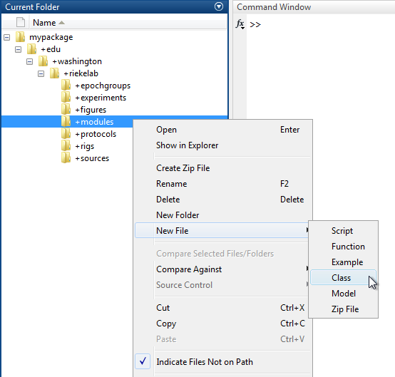
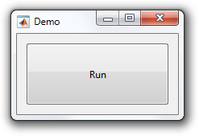

# Write a Module

This tutorial shows how to write a `Module`.

- [Step 1: Create a class](#step-1-create-a-class)
- [Step 2: Override createUi](#step-2-override-createui)
- [Step 3: Use services](#step-3-use-services)

### Step 1: Create a class
A `Module` is simply a MATLAB class that [subclasses](http://www.mathworks.com/help/matlab/matlab_oop/creating-subclasses--syntax-and-techniques.html) from `symphonyui.ui.Module`.

Create a new class in your personal Symphony [package](Create-a-Package.md) by navigating to the package in MATLAB's **Current Folder**, right-clicking on the "+modules" directory, and selecting **New File > Class**.



Name the class file "Demo.m" and open it in the MATLAB Editor.

```matlab
classdef Demo
    %DEMO Summary of this class goes here
    %   Detailed explanation goes here

    properties
    end

    methods
    end

end
```

Remove the comments and edit the classdef line to subclass from the `symphonyui.ui.Module` class.

```matlab
classdef Demo < symphonyui.ui.Module

    properties
    end

    methods
    end

end
```

You now have an empty `Module`.

### Step 2: Override createUi
You add user interface controls to a module by [overriding](http://www.mathworks.com/help/matlab/matlab_oop/modifying-superclass-methods-and-properties.html) the `createUi()` method.

Override the `createUi()` method in the "Demo" module.

```matlab
classdef Demo < symphonyui.ui.Module

    properties
    end

    methods

        function createUi(obj, figureHandle)

        end

    end

end
```

Set the figure title to "Demo" and the size to 200 by 100.

```matlab
function createUi(obj, figureHandle)
    set(figureHandle, ...
        'Name', 'Demo', ...
        'Position', appbox.screenCenter(200, 100));
end
```

Add a "Run" button to the figure and implement its [callback function](http://www.mathworks.com/help/matlab/creating_guis/write-callbacks-using-the-programmatic-workflow.html).

```matlab
function createUi(obj, figureHandle)
    set(figureHandle, ...
        'Name', 'Demo', ...
        'Position', appbox.screenCenter(200, 100));

    layout = uix.HBox( ...
        'Parent', figureHandle, ...
        'Padding', 11);

    uicontrol( ...
        'Parent', layout, ...
        'Style', 'pushbutton', ...
        'String', 'Run', ...
        'Callback', @obj.onSelectedRun);
end

function onSelectedRun(obj, ~, ~)

end
```

<table cellspacing="0" class="note" summary="Note" cellpadding="5" border="1"><tbody><tr width="90%"><td>
<b>Note:</b> Symphony includes the <a href="http://www.mathworks.com/matlabcentral/fileexchange/47982-gui-layout-toolbox">GUI Layout Toolbox</a>, seen being used to create a layout above. While not required, it is highly recommended that you use the layout toolbox if you want to make anything more than the simplest module UI.
</td></tr></tbody></table>

You now have a `Module` with a single button.



### Step 3: Use services
The Symphony app is built on three services that all modules have access to:

- `symphonyui.app.AcquistionService` - Contains methods related to selecting and controlling protocols.
- `symphonyui.app.ConfigurationService` - Contains methods related to initializing and controlling rigs.
- `symphonyui.app.DocumentationService` - Contains methods related to creating and controlling files.

You can utilize these services to access capabilities of the Symphony app from within a module, such as selecting a protocol, setting its property values, and running it or starting a new file, adding a source, and beginning an epoch group. The services are accessible through the `acquisitionService`, `configurationService`, and `documentationService` properties of a module.

Edit the `onSelectedRun()` method implemented above to run the current selected protocol when the "Run" button is pressed.

```matlab
function onSelectedRun(obj, ~, ~)
    obj.acquisitionService.viewOnly();
end
```

You now have a simple, fully functioning, `Module`.
