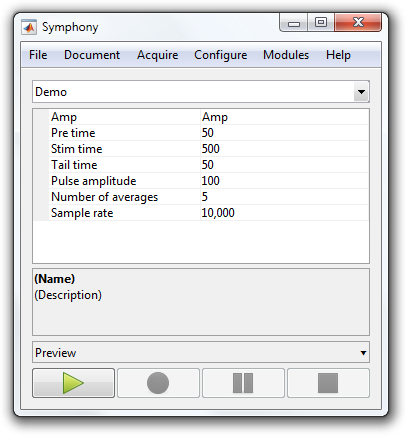

# Write a Protocol

This tutorial shows how to write a `Protocol`.

- [Step 1: Create a class](#step-1-create-a-class)
- [Step 2: Add properties](#step-2-add-properties)
- [Step 3: Override prepareEpoch](#step-3-override-prepareepoch)
- [Step 4: Override shouldContinuePreparingEpochs](#step-4-override-shouldcontinuepreparingepochs)
- [Step 5: Override shouldContinueRun](#step-5-override-shouldcontinuerun)

### Step 1: Create a class
A `Protocol` is simply a MATLAB class that [subclasses](http://www.mathworks.com/help/matlab/matlab_oop/creating-subclasses--syntax-and-techniques.html) from `symphonyui.core.Protocol`.

Create a new class in your personal Symphony [package](Create-a-Package.md) by navigating to the package in MATLAB's **Current Folder**, right-clicking on the "+protocols" directory, and selecting **New File > Class**.


Name the class file "Demo.m" and open it in the MATLAB Editor.

```matlab
classdef Demo
    %DEMO Summary of this class goes here
    %   Detailed explanation goes here

    properties
    end

    methods
    end

end
```

Remove the comments and edit the classdef line to subclass from the `symphonyui.core.Protocol` class.

```matlab
classdef Demo < symphonyui.core.Protocol

    properties
    end

    methods
    end

end
```

You now have an empty `Protocol`.

### Step 2: Add properties
The [properties](http://www.mathworks.com/help/matlab/matlab_oop/specifying-properties.html) of a `Protocol` define the user-configurable values that populate the **Protocol Properties** section of the main window when your protocol is selected.

Add a few properties to the "Demo" properties block to accept user-configurable values for a pulse.

```matlab
classdef Demo < symphonyui.core.Protocol

    properties
        amp
        preTime
        stimTime
        tailTime
        pulseAmplitude
        numberOfAverages
    end

    methods
    end

end
```

Add a [default value](http://www.mathworks.com/help/matlab/matlab_oop/specifying-properties.html#brqy3km-10) and comment to each property to make the protocol more user-friendly.

```matlab
classdef Demo < symphonyui.core.Protocol

    properties
        amp = 'Amp'                     % Output amplifier
        preTime = 50                    % Pulse leading duration (ms)
        stimTime = 500                  % Pulse duration (ms)
        tailTime = 50                   % Pulse trailing duration (ms)
        pulseAmplitude = 100            % Pulse amplitude (mV)
        numberOfAverages = 5            % Number of epochs
    end

    methods
    end

end
```

You now have a `Protocol` with user-configurable properties.


<table cellspacing="0" class="note" summary="Note" cellpadding="5" border="1"><tbody><tr width="90%"><td>
<b>Note:</b> All protocols inherit a "sampleRate" property.
</td></tr></tbody></table>

### Step 3: Override prepareEpoch
The behavior of a protocol is defined by [overriding methods](http://www.mathworks.com/help/matlab/matlab_oop/modifying-superclass-methods-and-properties.html) of the `symphonyui.core.Protocol` superclass. The methods include (not a complete list):

- `prepareRun(obj)` - Override to perform actions before the start of the first epoch.
- `prepareEpoch(obj, epoch)` - Override to perform actions before each epoch is added to the epoch queue.
- `completeEpoch(obj, epoch)` - Override to perform actions after each epoch is completed.
- `shouldContinuePreparingEpochs(obj)` - Override to return true/false to indicate if this protocol should continue preparing epochs.
- `shouldContinueRun(obj)` - Override to return true/false to indicate if this protocol should continue run.
- `completeRun(obj)` - Override to perform actions after the last epoch has completed.

Override the `prepareEpoch()` method in the "Demo" protocol so you can add a stimulus and response to each epoch.

```matlab
classdef Demo < symphonyui.core.Protocol

    properties
        amp = 'Amp'                     % Output amplifier
        preTime = 50                    % Pulse leading duration (ms)
        stimTime = 500                  % Pulse duration (ms)
        tailTime = 50                   % Pulse trailing duration (ms)
        pulseAmplitude = 100            % Pulse amplitude (mV)
        numberOfAverages = 5            % Number of epochs
    end

    methods

        function prepareEpoch(obj, epoch)

        end

    end

end
```

Whenever you override a `Protocol` method you always want to [call the superclass](http://www.mathworks.com/help/matlab/matlab_oop/calling-superclass-methods-on-subclass-objects.html) first so it can perform default behavior. Add a call to the superclass method in the "Demo" `prepareEpoch()` method.

```matlab
function prepareEpoch(obj, epoch)
    prepareEpoch@symphonyui.core.Protocol(obj, epoch);

end
```

Add a pulse stimulus to the amplifier in each epoch by using a [`PulseGenerator`](Standard-Stimulus-Generators.md) and calling the `addStimulus()` method on the epoch passed to `prepareEpoch()`.

```matlab
function prepareEpoch(obj, epoch)
    prepareEpoch@symphonyui.core.Protocol(obj, epoch);

    gen = symphonyui.builtin.stimuli.PulseGenerator();

    gen.preTime = obj.preTime;
    gen.stimTime = obj.stimTime;
    gen.tailTime = obj.tailTime;
    gen.amplitude = obj.pulseAmplitude;
    gen.mean = 0;
    gen.sampleRate = obj.sampleRate;
    gen.units = 'mV';

    stimulus = gen.generate();
    device = obj.rig.getDevice(obj.amp);

    epoch.addStimulus(device, stimulus);
end
```

Add a response from the amplifier in each epoch by calling `addResponse()`.

```matlab
function prepareEpoch(obj, epoch)
    prepareEpoch@symphonyui.core.Protocol(obj, epoch);

    gen = symphonyui.builtin.stimuli.PulseGenerator();

    gen.preTime = obj.preTime;
    gen.stimTime = obj.stimTime;
    gen.tailTime = obj.tailTime;
    gen.amplitude = obj.pulseAmplitude;
    gen.mean = 0;
    gen.sampleRate = obj.sampleRate;
    gen.units = 'mV';

    stimulus = gen.generate();
    device = obj.rig.getDevice(obj.amp);

    epoch.addStimulus(device, stimulus);
    epoch.addResponse(device);
end
```

You now have a `Protocol` that produces epochs with a pulse stimulus presented to, and a response recorded from, the amplifier device.

### Step 4: Override shouldContinuePreparingEpochs
A protocol needs to indicate when it no longer wants to prepare any more epochs. This is generally done when the number of prepared epochs equals the number of epochs specified by the user through a protocol property, like `numberOfAverages`.

All protocols keep track of the current number of prepared epochs in a `numEpochsPrepared` property. Override the `shouldContinuePreparingEpochs()` method in "Demo" to return false when the `numEpochsPrepared` is greater than or equal to `numberOfAverages`.

```matlab
function tf = shouldContinuePreparingEpochs(obj)
    tf = obj.numEpochsPrepared < obj.numberOfAverages;
end
```

<table cellspacing="0" class="note" summary="Note" cellpadding="5" border="1"><tbody><tr width="90%"><td>
<b>Note:</b> <code>shouldContinuePreparingEpochs()</code> and <code>shouldContinueRun()</code> are some of the few protocol methods you can override without worrying about calling their superclass method. However there is also no harm in doing so.
</td></tr></tbody></table>

You now have a `Protocol` that will prepare the number of epochs equal to the value of `numberOfAverages`.

### Step 5: Override shouldContinueRun
A protocol also needs to indicate when it no longer wants to run. This is generally done when the number of completed epochs equals the number of epochs specified by the user.

All protocols keep track of the current number of completed epoch in a `numEpochsCompleted` property. Override the `shouldContinueRun()` method in "Demo" to return false when the `numEpochsCompleted` is greater than or equal to `numberOfAverages`.

```matlab
function tf = shouldContinueRun(obj)
    tf = obj.numEpochsCompleted < obj.numberOfAverages;
end
```

You now have a fully functioning `Protocol`.

```matlab
classdef Demo < symphonyui.core.Protocol

    properties
        amp = 'Amp'                     % Output amplifier
        preTime = 50                    % Pulse leading duration (ms)
        stimTime = 500                  % Pulse duration (ms)
        tailTime = 50                   % Pulse trailing duration (ms)
        pulseAmplitude = 100            % Pulse amplitude (mV)
        numberOfAverages = 5            % Number of epochs
    end

    methods

        function prepareEpoch(obj, epoch)
            prepareEpoch@symphonyui.core.Protocol(obj, epoch);

            gen = symphonyui.builtin.stimuli.PulseGenerator();

            gen.preTime = obj.preTime;
            gen.stimTime = obj.stimTime;
            gen.tailTime = obj.tailTime;
            gen.amplitude = obj.pulseAmplitude;
            gen.mean = 0;
            gen.sampleRate = obj.sampleRate;
            gen.units = 'mV';

            stimulus = gen.generate();
            device = obj.rig.getDevice(obj.amp);

            epoch.addStimulus(device, stimulus);
            epoch.addResponse(device);
        end

        function tf = shouldContinuePreparingEpochs(obj)
            tf = obj.numEpochsPrepared < obj.numberOfAverages;
        end

        function tf = shouldContinueRun(obj)
            tf = obj.numEpochsCompleted < obj.numberOfAverages;
        end

    end

end
```

If your personal package is in the Symphony path you should now be able to run the "Demo" protocol from the main window (it will not show any figures while running, however, until you [show figure handlers](Show-Figure-Handlers-in-a-Protocol.md)).


