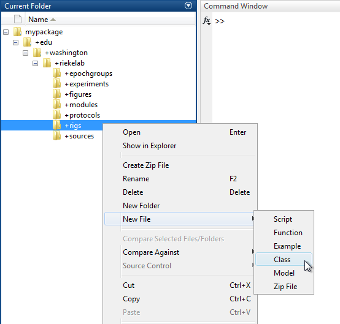
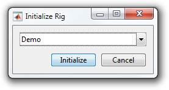

# Write a Rig Description

This tutorial shows how to write a `RigDescription`.

- [Step 1: Create a class](#step-1-create-a-class)
- [Step 2: Set the DAQ controller](#step-2-set-the-daq-controller)
- [Step 3: Add devices](#step-3-add-devices)
- [Step 4: Bind devices](#step-4-bind-devices)

### Step 1: Create a class
A `RigDescription` is simply a MATLAB class that [subclasses](http://www.mathworks.com/help/matlab/matlab_oop/creating-subclasses--syntax-and-techniques.html) from `symphonyui.core.descriptions.RigDescription`.

Create a new class in your personal Symphony [package](Create-a-Package) by navigating to the package in MATLAB's **Current Folder**, right-clicking on the "+rigs" directory, and selecting **New File > Class**.



Name the class file "Demo.m" and open it in the MATLAB Editor.

```matlab
classdef Demo
    %DEMO Summary of this class goes here
    %   Detailed explanation goes here

    properties
    end

    methods
    end

end
```

Remove the comments and properties block and edit the classdef line to subclass from the `symphonyui.core.descriptions.RigDescription` class.

```matlab
classdef Demo < symphonyui.core.descriptions.RigDescription

    methods
    end

end
```

Add a [constructor method](http://www.mathworks.com/help/matlab/matlab_oop/class-constructor-methods.html) with no input arguments.

```matlab
classdef Demo < symphonyui.core.descriptions.RigDescription

    methods

        function obj = Demo()

        end

    end

end
```

You now have an empty `RigDescription`.

### Step 2: Set the DAQ controller
A `DaqController` manages an A/D device such as an ITC-18. Symphony comes with two built-in `DaqController` implementations:

- `symphonyui.builtin.daqs.HekaDaqController` - Manages a Heka/Instrutech DAQ interface (ITC-16, ITC-18, or ITC-1600).
- `symphonyui.builtin.daqs.HekaSimulationDaqController` - Manages a simulated Heka/Instrutech DAQ interface (requires no attached hardware).

Set the "Demo" description controller by instantiating a `HekaSimulationDaqController` in the constructor method and assigning it to the `daqController` property of the description.

```matlab
function obj = Demo()
    import symphonyui.builtin.daqs.*;

    daq = HekaSimulationDaqController();
    obj.daqController = daq;
end
```

<table cellspacing="0" class="note" summary="Note" cellpadding="5" border="1"><tbody><tr width="90%"><td>
<b>Note:</b> The <a href="http://www.mathworks.com/help/matlab/ref/import.html">import</a> statement allows you to refer to a class without specifying the entire package name. Without it you would have to write out the entire package name when instantiating <code>HekaSimulationDaqController</code> (e.g. <code>daq = symphonyui.builtin.daqs.HekaSimulationDaqController()</code>)
</td></tr></tbody></table>

You now have a `RigDescription` that describes a rig with a simulated Heka DAQ interface.

### Step 3: Add devices
A `Device` represents a single physical hardware device attached to a rig. Symphony comes with four built-in `Device` implementations:

- `symphonyui.builtin.devices.AxopatchDevice` - Represents an Axopatch device.
- `symphonyui.builtin.devices.MultiClampDevice` - Represents a MultiClamp 700[A,B] device.
- `symphonyui.builtin.devices.UnitConvertingDevice` - Represents a generic device (LED, valve, temperature controller, etc.).
- `symphonyui.builtin.devices.CalibratedDevice` - Represents a `UnitConvertingDevice` with an associated lookup table (LUT).

Add a `MultiClampDevice` named "Amp" to the "Demo" description by instantiating an instance and passing it as a parameter to the `addDevice()` method.

```matlab
function obj = Demo()
    import symphonyui.builtin.daqs.*;
    import symphonyui.builtin.devices.*;

    daq = HekaSimulationDaqController();
    obj.daqController = daq;

    % Add a MultiClamp device with name = Amp, channel = 1
    amp = MultiClampDevice('Amp', 1);
    obj.addDevice(amp);
end
```

Add a `UnitConvertingDevice` named "Green LED".

```matlab
function obj = Demo()
    import symphonyui.builtin.daqs.*;
    import symphonyui.builtin.devices.*;

    daq = HekaSimulationDaqController();
    obj.daqController = daq;

    % Add a MultiClamp device with name = Amp, channel = 1
    amp = MultiClampDevice('Amp', 1);
    obj.addDevice(amp);

    % Add a LED device with name = Green LED, units = volts
    green = UnitConvertingDevice('Green LED', 'V');
    obj.addDevice(green);
end
```

You now have a `RigDescription` with a simulated Heka DAQ interface and two devices.

### Step 4: Bind devices
You must describe how your devices are wired to the DAQ by binding them to `DaqStreams`. A `DaqStream` represents a hardware channel of a DAQ interface.

Bind the Amp device to analog output channel 0 by retrieving the analog output channel 0 `DaqStream` from the controller and passing it as a parameter to the `bindStream()` method of the Amp device.

```matlab
function obj = Demo()
    import symphonyui.builtin.daqs.*;
    import symphonyui.builtin.devices.*;

    daq = HekaSimulationDaqController();
    obj.daqController = daq;

    % Add a MultiClamp device with name = Amp, channel = 1
    amp = MultiClampDevice('Amp', 1);
    obj.addDevice(amp);

    % Add a LED device with name = Green LED, units = volts
    green = UnitConvertingDevice('Green LED', 'V');
    obj.addDevice(green);

    % Bind devices
    amp.bindStream(daq.getStream('ANALOG_OUT.0'));
end
```

Do the same to additionally bind the Amp device to analog input channel 0 and the Green LED device to analog output channel 1.

```matlab
function obj = Demo()
    import symphonyui.builtin.daqs.*;
    import symphonyui.builtin.devices.*;

    daq = HekaSimulationDaqController();
    obj.daqController = daq;

    % Add a MultiClamp device with name = Amp, channel = 1
    amp = MultiClampDevice('Amp', 1);
    obj.addDevice(amp);

    % Add a LED device with name = Green LED, units = volts
    green = UnitConvertingDevice('Green LED', 'V');
    obj.addDevice(green);

    % Bind devices
    amp.bindStream(daq.getStream('ANALOG_OUT.0'));
    amp.bindStream(daq.getStream('ANALOG_IN.0'));

    green.bindStream(daq.getStream('ANALOG_OUT.1'));
end
```

As a matter of convenience you can also bind devices on the same line you instantiate them. The code block below is functionally equivalent to the one above.

```matlab
function obj = Demo()
    import symphonyui.builtin.daqs.*;
    import symphonyui.builtin.devices.*;

    daq = HekaSimulationDaqController();
    obj.daqController = daq;

    % Add a MultiClamp device with name = Amp, channel = 1
    amp = MultiClampDevice('Amp', 1).bindStream(daq.getStream('ANALOG_OUT.0')).bindStream(daq.getStream('ANALOG_IN.0'));
    obj.addDevice(amp);

    % Add a LED device with name = Green LED, units = volts
    green = UnitConvertingDevice('Green LED', 'V').bindStream(daq.getStream('ANALOG_OUT.1'));
    obj.addDevice(green);
end
```

The "Demo" description is now complete.

```matlab
classdef Demo < symphonyui.core.descriptions.RigDescription

    methods

        function obj = Demo()
            import symphonyui.builtin.daqs.*;
            import symphonyui.builtin.devices.*;

            daq = HekaSimulationDaqController();
            obj.daqController = daq;

            % Add a MultiClamp device with name = Amp, channel = 1
            amp = MultiClampDevice('Amp', 1).bindStream(daq.getStream('ANALOG_OUT.0')).bindStream(daq.getStream('ANALOG_IN.0'));
            obj.addDevice(amp);

            % Add a LED device with name = Green LED, units = volts
            green = UnitConvertingDevice('Green LED', 'V').bindStream(daq.getStream('ANALOG_OUT.1'));
            obj.addDevice(green);
        end

    end

end
```

If your personal package is in the Symphony path you should now be able to initialize with the "Demo" description when starting Symphony.


