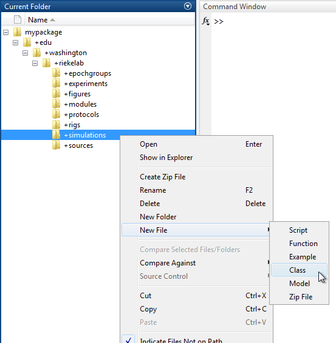

# Write a Simulation

This tutorial shows you how to write a `Simulation`.

- [Step 1: Create a class](#step-1-create-a-class)
- [Step 2: Override run](#step-2-override-run)
- [Step 3: Add input data to the input map](#step-3-add-input-data-to-the-input-map)
- [Step 4: Use output data to simulate input data](#step-4-use-output-data-to-simulate-input-data)

### Step 1: Create a class
A `Simulation` is simply a MATLAB class that [subclasses](http://www.mathworks.com/help/matlab6/matlab_oop/creating-subclasses--syntax-and-techniques.html) from `symphonyui.core.Simulation`.

Create a new class in your personal Symphony [package](Create-a-Package.md) by navigating to the package in MATLAB's **Current Folder**, right-clicking on the "+simulations" directory, and selecting **New File > Class**.



Name the class file "Demo.m" and open it in the MATLAB Editor.

```matlab
classdef Demo
    %DEMO Summary of this class goes here
    %   Detailed explanation goes here

    properties
    end

    methods
    end

end
```

Remove the comments and properties block and edit the classdef line to subclass from the `symphonyui.core.Simulation` class.

```matlab
classdef Demo < symphonyui.core.Simulation

    methods
    end

end
```

You now have an empty `Simulation`.

### Step 2: Override run
When a simulated DAQ controller needs to "acquire" data, it calls the `run()` method of a simulation and passes it the data its "outputting" and the duration of the input data its expecting the simulation to generate. The simulation then decides how to generate input data based on these parameters.

The simulation `run()` method is generally called many times over the course of a complete run. The simulated DAQ controller use the simulation to generate only small chunks of data at a time. The duration of these chunks is determined by the simulation time step. The simulation time step is generally 0.5 seconds but may vary.

Override the `run()` method in the "Demo" simulation so you can define what it does when a DAQ controller needs to simulate input data for a simulation time step.

```matlab
classdef Demo < symphonyui.core.Simulation

    methods

        function inputMap = run(obj, daq, outputMap, timeStep)

        end

    end

end
```

The `run()` method take three parameters:

- "daq" - The current `DaqController`.
- "outputMap" - A [map](http://www.mathworks.com/help/matlab/ref/containers.map-class.html) from output stream names (i.e. channels) to output data for the current simulation time step.
- "timeStep" - The [duration](http://www.mathworks.com/help/matlab/ref/duration.html) of the current simulation time step.

Given these parameters, the `run()` method must return a single value:

- "inputMap" - A [map](http://www.mathworks.com/help/matlab/ref/containers.map-class.html) from input stream names (i.e. channels) to input data for the current simulation time step.

Create an "inputMap" variable by instantiating an empty map.

```matlab
classdef Demo < symphonyui.core.Simulation

    methods

        function inputMap = run(obj, daq, outputMap, timeStep)
            inputMap = containers.Map();

        end

    end

end
```

Add a key to the "inputMap" with the name of each active input streams in the current `DaqController`.

```matlab
inputMap = containers.Map();

inputStreams = daq.getInputStreams();
for i = 1:numel(inputStreams)
    inStream = inputStreams{i};

    if ~inStream.active
        % We don't care to process inactive input streams (i.e. channels without devices).
        continue;
    end

    % Add a key for the active input stream with an empty value.
    inputMap(inStream.name) = [];
end
```

You now have a `Simulation` that returns a map with no input data.

```matlab
classdef Demo < symphonyui.core.Simulation

    methods

        function inputMap = run(obj, daq, outputMap, timeStep)
            inputMap = containers.Map();

            inputStreams = daq.getInputStreams();
            for i = 1:numel(inputStreams)
                inStream = inputStreams{i};

                if ~inStream.active
                    % We don't care to process inactive input streams (i.e. channels without devices).
                    continue;
                end

                % Add a key for the active input stream with an empty value.
                inputMap(inStream.name) = [];
            end
        end

    end

end
```

### Step 3: Add input data to the input map
If you ran this simulation as is, epochs would never complete because you are not yet producing any input data. You must associate each key in the input map with simulated "acquired" data for the simulation time step.

Simulate a vector of noise data for each input stream by using `rand()` for analog input streams and `randi()` for digital input streams.

```matlab
inputMap = containers.Map();

inputStreams = daq.getInputStreams();
for i = 1:numel(inputStreams)
    inStream = inputStreams{i};

    if ~inStream.active
        % We don't care to process inactive input streams (i.e. channels without devices).
        continue;
    end

    % Simulate input data.
    rate = inStream.sampleRate;
    nsamples = seconds(timeStep) * rate.quantityInBaseUnits;
    if strncmp(inStream.name, 'diport', 6)
        % Simulate digital noise.
        quantities = randi(2^16-1, 1, nsamples);
    else
        % Simulate analog noise.
        quantities = rand(1, nsamples) - 0.5;
    end

    inputMap(inStream.name) = [];
end
```

Use the simulated "quantities" vector to instantiate an `InputData` object for each key in the map.

```matlab
inputMap = containers.Map();

inputStreams = daq.getInputStreams();
for i = 1:numel(inputStreams)
    inStream = inputStreams{i};

    if ~inStream.active
        % We don't care to process inactive input streams (i.e. channels without devices).
        continue;
    end

    % Simulate input data.
    rate = inStream.sampleRate;
    nsamples = seconds(timeStep) * rate.quantityInBaseUnits;
    if strncmp(inStream.name, 'diport', 6)
        % Simulate digital noise.
        quantities = randi(2^16-1, 1, nsamples);
    else
        % Simulate analog noise.
        quantities = rand(1, nsamples) - 0.5;
    end

    units = inStream.measurementConversionTarget;

    inputMap(inStream.name) = symphonyui.core.InputData(quantities, units, rate);
end
```

You now have a fully functioning `Simulation` that simulates noise on each input stream.

```matlab
classdef Demo < symphonyui.core.Simulation

    methods

        function inputMap = run(obj, daq, outputMap, timeStep)
            inputMap = containers.Map();

            inputStreams = daq.getInputStreams();
            for i = 1:numel(inputStreams)
                inStream = inputStreams{i};

                if ~inStream.active
                    % We don't care to process inactive input streams (i.e. channels without devices).
                    continue;
                end

                % Simulate input data.
                rate = inStream.sampleRate;
                nsamples = seconds(timeStep) * rate.quantityInBaseUnits;
                if strncmp(inStream.name, 'diport', 6)
                    % Simulate digital noise.
                    quantities = randi(2^16-1, 1, nsamples);
                else
                    % Simulate analog noise.
                    quantities = rand(1, nsamples) - 0.5;
                end

                units = inStream.measurementConversionTarget;

                inputMap(inStream.name) = symphonyui.core.InputData(quantities, units, rate);
            end
        end

    end

end
```

### Step 4: Use output data to simulate input data
The "outputMap" parameter passed into the simulation function allows you to access the output data for each active output stream in the current simulation time step. You can use this output data to determine how you want your simulation function to simulate input data.

Add an additional `if` statement to the "Simulate input data" `if` block to determine if the current stream in the loop is the analog input 0 stream (i.e. if it has the stream name "ai0"). If so, get a vector of the quantities for the output data on the analog output 0 stream from the "outputMap" and use it (with some added noise) as input data for the analog input 0 stream.

```matlab
inputMap = containers.Map();

inputStreams = daq.getInputStreams();
for i = 1:numel(inputStreams)
    inStream = inputStreams{i};

    if ~inStream.active
        % We don't care to process inactive input streams (i.e. channels without devices).
        continue;
    end

    % Simulate input data.
    rate = inStream.sampleRate;
    nsamples = seconds(timeStep) * rate.quantityInBaseUnits;
    if strcmp(inStream.name, 'ai0')
        % Simulate the output signal + noise.
        outData = outputMap('ao0');
        [outQuantities, outUnits] = outData.getData();
        quantities = outQuantities + rand(1, nsamples) - 0.5;
    elseif strncmp(inStream.name, 'diport', 6)
        % Simulate digital noise.
        quantities = randi(2^16-1, 1, nsamples);
    else
        % Simulate analog noise.
        quantities = rand(1, nsamples) - 0.5;
    end

    units = inStream.measurementConversionTarget;

    inputMap(inStream.name) = symphonyui.core.InputData(quantities, units, rate);
end
```

You now have a fully functioning `Simulation` that simulates a loopback of the analog output 0 signal on the analog input 0 stream and noise on all other input streams.

```matlab
classdef Demo < symphonyui.core.Simulation

    methods

        function inputMap = run(obj, daq, outputMap, timeStep)
            inputMap = containers.Map();

            inputStreams = daq.getInputStreams();
            for i = 1:numel(inputStreams)
                inStream = inputStreams{i};

                if ~inStream.active
                    % We don't care to process inactive input streams (i.e. channels without devices).
                    continue;
                end

                % Simulate input data.
                rate = inStream.sampleRate;
                nsamples = seconds(timeStep) * rate.quantityInBaseUnits;
                if strcmp(inStream.name, 'ai0')
                    % Simulate the output signal + noise.
                    outData = outputMap('ao0');
                    [outQuantities, outUnits] = outData.getData();
                    quantities = outQuantities + rand(1, nsamples) - 0.5;
                elseif strncmp(inStream.name, 'diport', 6)
                    % Simulate digital noise.
                    quantities = randi(2^16-1, 1, nsamples);
                else
                    % Simulate analog noise.
                    quantities = rand(1, nsamples) - 0.5;
                end

                units = inStream.measurementConversionTarget;

                inputMap(inStream.name) = symphonyui.core.InputData(quantities, units, rate);
            end
        end

    end

end
```

To use a `Simulation`, refer to the ["Set the Simulation for a DAQ Controller" tutorial](Set-a-Simulation-for-a-DAQ-Controller.md).
