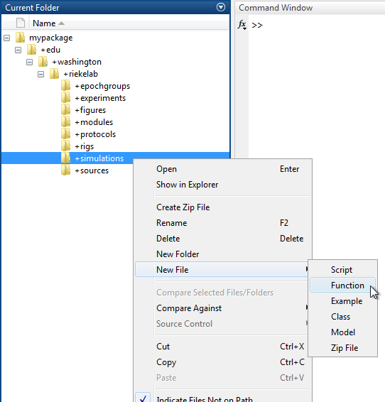

# Write a Simulation

A `Simulation` is function that simulates "acquired" data for each input stream (i.e. channel) of a simulated DAQ interface. It is generally called once per 0.5 second time step of a run. Thus a 10 second run of a protocol would generally call a simulation function 20 times.

Each time a simulation function is called, it is passed three parameters:

- "daq" - The `DaqController` of the current rig.
- "outputMap" - A [map](http://www.mathworks.com/help/matlab/ref/containers.map-class.html) from output stream names (i.e. channels) to output data for the current simulation time step.
- "timeStep" - The [duration](http://www.mathworks.com/help/matlab/ref/duration.html) of the current simulation time step.

Given these parameters, the simulation function must return a single value:

- "inputMap" - A [map](http://www.mathworks.com/help/matlab/ref/containers.map-class.html) from input stream names (i.e. channels) to input data for the current simulation time step.

This tutorial shows you how to write a `Simulation`.

- [Step 1: Create a function](#step-1-create-a-function)
- [Step 2: Create an input map](#step-2-create-an-input-map)
- [Step 3: Add input data to the input map](#step-3-add-input-data-to-the-input-map)
- [Step 4: Use output data to simulate input data](#step-4-use-output-data-to-simulate-input-data)

### Step 1: Create a function
A `Simulation` is simply a MATLAB function with a particular set of inputs and outputs.

Create a new function in your Symphony [package](Create-a-Package.md) by navigating to the package in MATLAB's **Current Folder**, right-clicking on the "+simulations" directory, and selecting **New File > Function**.



Name the function file "demo.m" and open it in the MATLAB Editor.

```matlab
function [ output_args ] = demo( input_args )
%DEMO Summary of this function goes here
%   Detailed explanation goes here


end
```

Remove the comments and edit the function line to accept three inputs named "daq", "outputMap", and "timeStep" and return one output named "inputMap".

```matlab
function inputMap = demo(daq, outputMap, timeStep)

end
```

You now have an empty `Simulation`.

### Step 2: Create an input map
A `Simulation` function must return a single map containing a [key](http://www.mathworks.com/help/matlab/matlab_prog/overview-of-the-map-data-structure.html) for each active input stream in the current DAQ controller.

Create an "inputMap" variable by instantiating an empty map.

```matlab
function inputMap = demo(daq, outputMap, timeStep)
    inputMap = containers.Map();
end
```

Add a key to the "inputMap" with the name of each active input streams in the current `DaqController`.

```matlab
function inputMap = demo(daq, outputMap, timeStep)
    inputMap = containers.Map();

    inputStreams = daq.getInputStreams();
    for i = 1:numel(inputStreams)
        inStream = inputStreams{i};

        if ~inStream.active
            % We don't care to process inactive input streams (i.e. channels without devices).
            continue;
        end

        % Add a key for the active input stream with an empty value.
        inputMap(inStream.name) = [];
    end
end
```

You now have a `Simulation` that returns a map with no input data.

### Step 3: Add input data to the input map
You must associate each key in the input map with simulated "acquired" data for the simulation time step.

Simulate a vector of noise data for each input stream by using `rand()` for analog input streams and `randi()` for digital input streams.

```matlab
function inputMap = demo(daq, outputMap, timeStep)
    inputMap = containers.Map();

    inputStreams = daq.getInputStreams();
    for i = 1:numel(inputStreams)
        inStream = inputStreams{i};

        if ~inStream.active
            % We don't care to process inactive input streams (i.e. channels without devices).
            continue;
        end

        % Simulate input data.
        rate = inStream.sampleRate;
        nsamples = seconds(timeStep) * rate.quantityInBaseUnits;
        if strncmp(inStream.name, 'diport', 6)
            % Simulate digital noise.
            quantities = randi(2^16-1, 1, nsamples);
        else
            % Simulate analog noise.
            quantities = rand(1, nsamples) - 0.5;
        end

        inputMap(inStream.name) = [];
    end
end
```

Use the simulated "quantities" vector to instantiate an `InputData` object for each key in the map.

```matlab
function inputMap = demo(daq, outputMap, timeStep)
    inputMap = containers.Map();

    inputStreams = daq.getInputStreams();
    for i = 1:numel(inputStreams)
        inStream = inputStreams{i};

        if ~inStream.active
            % We don't care to process inactive input streams (i.e. channels without devices).
            continue;
        end

        % Simulate input data.
        rate = inStream.sampleRate;
        nsamples = seconds(timeStep) * rate.quantityInBaseUnits;
        if strncmp(inStream.name, 'diport', 6)
            % Simulate digital noise.
            quantities = randi(2^16-1, 1, nsamples);
        else
            % Simulate analog noise.
            quantities = rand(1, nsamples) - 0.5;
        end

        units = inStream.measurementConversionTarget;

        inputMap(inStream.name) = symphonyui.core.InputData(quantities, units, rate);
    end
end
```

You now have a fully functioning `Simulation` that simulates noise on each input stream.

### Step 4: Use output data to simulate input data
The "outputMap" parameter passed into the simulation function allows you to access the output data for each active output stream in the current simulation time step. You can use this output data to determine how you want your simulation function to simulate input data.

Add an additional `if` statement to the "Simulate input data" `if` block to determine if the current stream in the loop is the analog input 0 stream (i.e. if it has the stream name "ai0"). If so, get a vector of the quantities for the output data on the analog output 0 stream from the "outputMap" and use it (with some added noise) as input data for the analog input 0 stream.

```matlab
function inputMap = demo(daq, outputMap, timeStep)
    inputMap = containers.Map();

    inputStreams = daq.getInputStreams();
    for i = 1:numel(inputStreams)
        inStream = inputStreams{i};

        if ~inStream.active
            % We don't care to process inactive input streams (i.e. channels without devices).
            continue;
        end

        % Simulate input data.
        rate = inStream.sampleRate;
        nsamples = seconds(timeStep) * rate.quantityInBaseUnits;
        if strcmp(inStream.name, 'ai0')
            % Simulate the output signal + noise.
            outData = outputMap('ao0');
            [outQuantities, outUnits] = outData.getData();
            quantities = outQuantities + rand(1, nsamples) - 0.5;
        elseif strncmp(inStream.name, 'diport', 6)
            % Simulate digital noise.
            quantities = randi(2^16-1, 1, nsamples);
        else
            % Simulate analog noise.
            quantities = rand(1, nsamples) - 0.5;
        end

        units = inStream.measurementConversionTarget;

        inputMap(inStream.name) = symphonyui.core.InputData(quantities, units, rate);
    end
end
```

You now have a fully functioning `Simulation` that simulates a loopback of the analog output 0 signal on the analog input 0 stream and noise on all other input streams.

To use a `Simulation`, refer to the ["Set the Simulation for a DAQ Controller" tutorial](Set-a-Simulation-for-a-DAQ-Controller.md).
