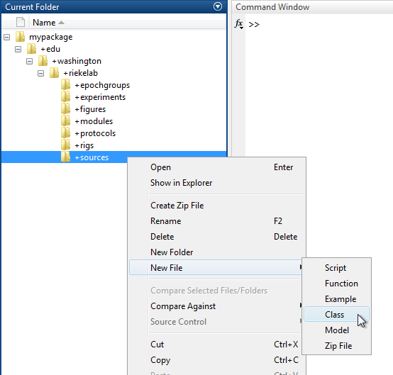
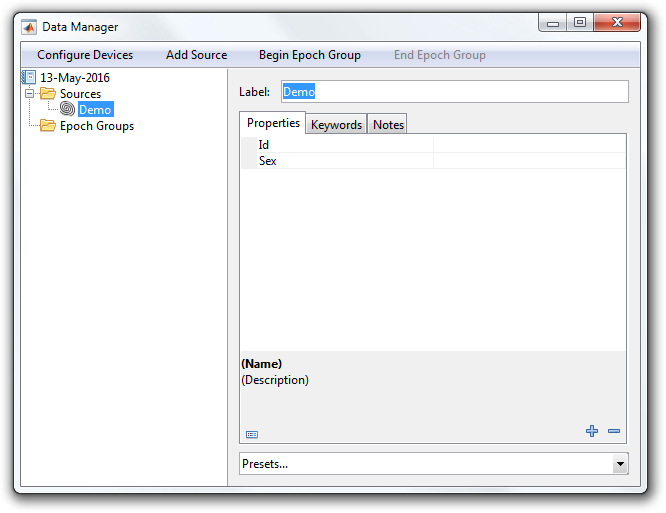

# Write an Entity Description

This tutorial shows how to write an `EntityDescription`.

- [Step 1: Create a class](#step-1-create-a-class)
- [Step 2: Add properties](#step-2-add-properties)

### Step 1: Create a class
An `EntityDescription` is simply a MATLAB class that [subclasses](http://www.mathworks.com/help/matlab/matlab_oop/creating-subclasses--syntax-and-techniques.html) from `symphonyui.core.persistent.descriptions.ExperimentDescription`, `symphonyui.core.persistent.descriptions.SourceDescription`, or `symphonyui.core.persistent.descriptions.EpochGroupDescription`.

Create a new class in your personal Symphony [package](Create-a-Package.md) by navigating to the package in MATLAB's **Current Folder**, right-clicking on the "+sources" directory, and selecting **New File > Class**.



Name the class file "Demo.m" and open it in the MATLAB Editor.

```matlab
classdef Demo
    %DEMO Summary of this class goes here
    %   Detailed explanation goes here

    properties
    end

    methods
    end

end
```

Remove the comments and properties block and edit the classdef line to subclass from the `symphonyui.core.persistent.descriptions.SourceDescription` class.

```matlab
classdef Demo < symphonyui.core.persistent.descriptions.SourceDescription

    methods
    end

end
```

Add a [constructor method](http://www.mathworks.com/help/matlab/matlab_oop/class-constructor-methods.html) with no input arguments.

```matlab
classdef Demo < symphonyui.core.persistent.descriptions.SourceDescription

    methods

        function obj = Demo()

        end

    end

end
```

You now have an empty `SourceDescription`.

### Step 2: Add properties
The metadata of an `EntityDescription` is described by properties.

Add a property named "id" with an initial value of "" to the description by adding a line calling the `addProperty()` method.

```matlab
function obj = Demo()
    obj.addProperty('id', '');
end
```

Add a property named "sex" with an initial value of "" to the description by adding another line calling the `addProperty()` method.

```matlab
function obj = Demo()
    obj.addProperty('id', '');
    obj.addProperty('sex', '');
end
```

The "Demo" source description now has two properties.

```matlab
classdef Demo < symphonyui.core.persistent.descriptions.SourceDescription

    methods

        function obj = Demo()
            obj.addProperty('id', '');
            obj.addProperty('sex', '');
        end

    end

end
```

Create a new file in Symphony and add a source using the "Demo" description to view and edit the properties.


